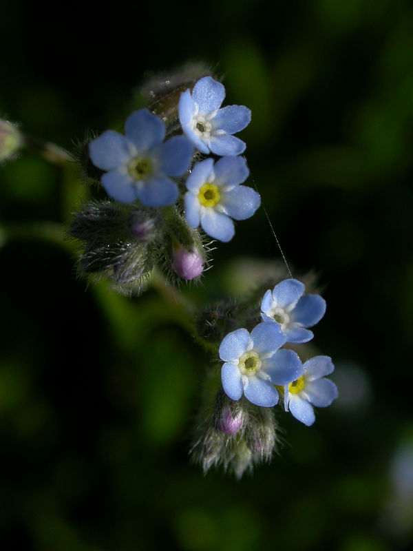

 This is a poinsettia, _Euphorbia pulcherrima_, the most beautiful euphorbia. (Euphorbius was a Greek physician, who promoted the use of resin spurge's sap as a painkiller. He was [right](https://www.sciencedirect.com/science/article/abs/pii/S002432059600567X) to do so.) You will note that the colour of the bracts (bracts are the leaves immediately below the flowers, which are are rather small) is red. Probably that is one reason why poinsettias have become the symbolic plant of this time of the year. Marketing decrees that the colours of Christmas are red and green. Poinsettias agree. Some breeders, however, cannot leave well enough alone. So they have created poinsettias of other hues; anaemic off-white, speckled, and other abominations. They have also selected extra-red poinsettias. This is going with the flow, and is A Good Thing.

Why am I mentioning this?

{.center} 

Because, it pains me to say, a blogchum, indeed, the Queen of Shag Buns herself, spent her hard-earned cash on one of the abominations. She labelled her prideful post [Kill Joy](https://bluegirlredstate.typepad.com/blue_girl/2007/12/kill-joy.html). And she even had the gall to post a photo of the thing. (That’s it, leached direct from her site, over there. Doesn't it look awful?) She says she did it because she couldn’t bring herself, Blue Girl, to have a hated red thing in her blue house. But I think she did it just to kill whatever little seasonal joy I might have managed to nurture in my own bosom.

The only good news in this otherwise dire saga is that the breeders aren’t entirely to blame. Blue Girl’s blue poinsettia is [dyed](https://www.washingtonpost.com/wp-dyn/content/article/2005/12/07/AR2005120700547.html). Just like Oscar Wilde’s green carnation, the effect depends on the plant unwittingly sucking up a pigment with its water. Which means that the poinsettia, should she fail to kill it, will return to its natural hue eventually. Alas, those bracts are likely to be the sickly off-white I mentioned earlier.

[{.center}](http://flickr.com/photos/ultimorollo/271036304/)

I also note, from the Post article linked above and my own researches, that spray-on shiny gold spinkles are also _de rigeur_ for fans of the abominable.

Novelty is all very well, and I suppose the markets will always reward some sorts of novelty. But I do honestly believe that the search for floral novelty does sometimes go too far. I saw a fimbriated cyclamen a few days ago that just looked ill. Efforts to produce a blue rose have so far been spectacularly ineffective. You want blue? Get an iris. Or a plumbago. Or a forget-me-not. Or any one of the other wonderful shades of blue that nature makes so readily available in her palette, aided and abetted by appropriate interference when necessary.

I know one cannot arbitrate for taste, and that the Konsumer is King (or Kween), but somehow I would still like those who have ultimate power to exercise ultimate restraint. To say, “Yes, I bet I could market a flower that would sing Yankee Doodle and spit cider in your ear, but I'm not going to.”

Flickr photos by [SARhounds](http://www.flickr.com/photos/12530381@N07/4163405002/) <del>[JohnMMM](http://flickr.com/photos/johnmphoto/317664583/)</del> and [Morti Riuuallon](http://flickr.com/photos/ultimorollo/271036304/) used under a Creative Commons Licence.
