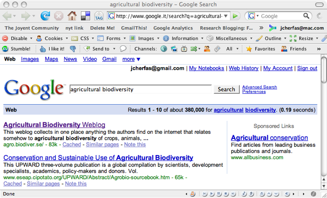

Over at [The Other Place](https://agro.biodiver.se/) I have ongoing discussions with Luigi (while we wait for the call from G****e) about the differences between momentary measures and long-term trends. He likes the former. I prefer the latter. [^fn1] But when he IMed me to say we our Google-fu was powerful, I had to go over and check. And then I had to record what I saw. But here, in order to avoid possible hubris.

{.center}

That’s for “agricultural biodiversity,” which has always been my favoured term anyway. The galling part is that “agrobiodiversity” is not up there, and above it is a pure shell with, as yet, no content.

[^fn1]: Like all generalizations, that one isn't worth a damn. 

