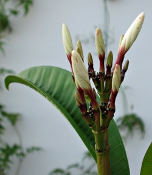
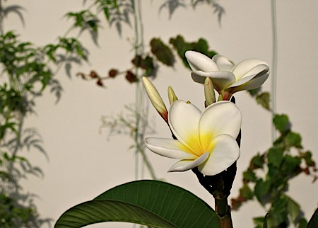
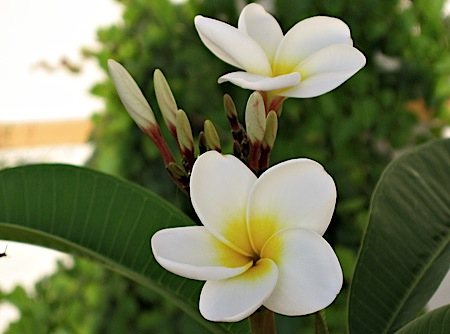

{.left} Longtime readers will know that I am [a patient gardener](http://jeremycherfas.net/blog/patience-rewarded/). Not for me the flashy allure of a large pot of instant floral gratification. I like to sow seeds, wait for them to emerge, pot them on, savour the passing time and the growth of the plant towards its final destiny. But even I suffer from bouts of impatience, and of late they’ve been worse. The problem is that damned frangipani opposite. Since the first post-winter stirrings a little more than six weeks ago I’ve watched each leaf take form, first folded tightly on itself down the midrib, then opening out and fiendishly glossy, and finally expanding and losing its sheen but gaining a certain majesty and heft. The flower buds too, fractally organized, have gone from tiny nubs that plainly weren’t leaves to proper nascent buds. And here’s where the impatience kicked in, because today I shall be away for three days, and I became absolutely convinced, over the past week, that the bloody things would open while I was away. That’s why I took that photograph opposite, because I knew I wouldn’t see them open.

I was wrong.

{.center}

Yesterday evening, going about my routine watering, I realized with a literal gasp that the two buds had blossomed. Such total, complete joy. I ran for my camera, and when he saw me emerge with a tiny camera atop a big tripod my summer roomie said, “Serious business, huh?”

“You bet.”

{.center}

Late last night I couldn’t keep from wandering over for a sniff and a marvel. I’ve always wanted a frangipani, ever since I can remember. And now I have one, and life is good.

For Massimo and Irina, who gave it to me last autumn, I have just one question: what kind of magic did you use to persuade it to flower yesterday, of all days? Thank you.
