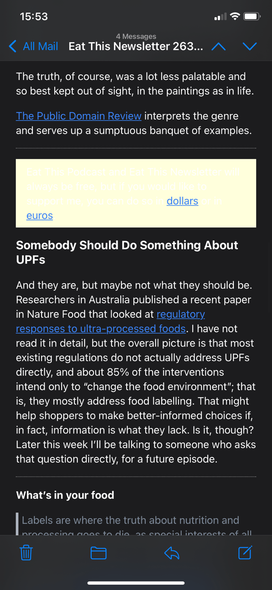
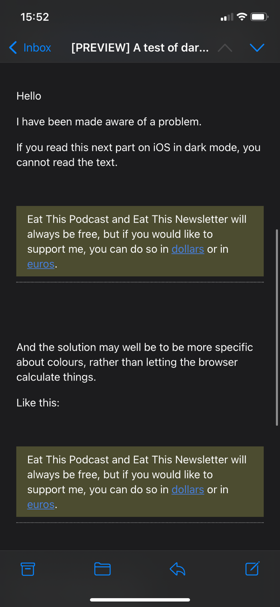

I have a little newsletter on Buttondown. It is free to anyone, although I can receive voluntary payments. To that end, I sometimes insert what is called an interstitial in messages to people who are not paying subscribers asking them to upgrade. And to make it stand out just a little I give it a pale yellow background. Whether it works to “convert” people I don’t know, but I do know that in one important respect, it didn’t work.

===

A reader, who does not pay, sent me a screenshot.

You can see the problem. In dark mode, the background remains pale yellow but the text is white and totally illegible apart from the blue links. Not nice at all.

I asked around in the #dev channel of [IndieWeb chat](https://indieweb.org/discuss) and quickly got two replies suggesting that it would be best to define the text colour rather than leave it to chance and algorithms. So I did, sending myself a draft email with first the standard version and second the amended version; the result surprised me.

Both versions are now perfectly legible. And the reason seems to be that having told the browser what colour the text should be once, it used that as a fallback elsewhere, even earlier in the document.

Then someone pointed out that it apparently used to be good practice, if you defined a background colour, to also define a colour; perhaps light/dark mode reintroduces the need. Certainly seems so.

So the people who receive the free version of the newsletter and read it in dark mode will now have no excuse, right?

Thanks to everyone who helped.
