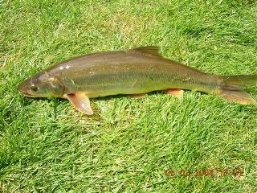

Policy-makers seem to find it hard to set fisheries policy. Fisherfolk seem to find it as hard to abide by the policies that are set. So it is with a spring in my stride and a song on my lips that I report an apparently fully successful use of straightforward economic incentives to achieve a laudable aim.

The story involves two fish, salmon and northern pikeminnow, and it takes place on the waters of the Columbia and the Snake rivers in Oregon.

{.right} The northern pikeminnow (_Ptychocheilus oregonensis_) used to be called the northern squawfish until the [American Fisheries Society](https://fisheries.org/html/index.shtml) changed its name. AFS’s Principle 9 says “Names shall not violate the tenets of good taste (e.g., names shall not contain offensive words),” which also did for the jewfish, now the Goliath Grouper. But that’s another story.

Salmon like running water. Humans like to build dams, and they also like to eat salmon, so they build fish ladders around the dams so that the salmon can climb to their spawning grounds. Northern pikeminnow prefer still water, so they like the dams. They also like to eat salmon, and feast on the young salmon smolts as they enter the dams on their way back to the sea.

The northern pikeminnow grow fat and plentiful in the still water of the dams. But they’re bony and bad eating and no fisherman would consider setting out to catch one. Unless, of course, there were a bounty on its head.

Which there is.

Every northern pikeminnow landed from the Columbia and Snake rivers is worth between $4 and $8, as long as it is longer than 9 inches (about 22.5 cm). A thousand specially tagged bonus fish have an outsize price of $500 on their heads specifically to attract lots of fishermen and to help biologists gauge the effect of the bounty. The [Bonneville Power Administration](https://www.bpa.gov/) (a federal agency) stumps up the cash to make up for the harm done by the government’s dams, and according to a [2005 press release](https://web.archive.org/web/20090424082907/http://www.bpa.gov/corporate/BPAnews/shorts/05/ns050405.cfm) incentivized the capture of more than 268,000 northern pikeminnow in 2004. In 2005 about 241,000 fish were caught and two fishermen pocketed more than $40,000.

All fine and dandy, but do the authorities really know what they’re doing? Is a bounty really the best way to control a predator species? Wasn’t it just such bounties that all but exterminated wolves, foxes, raccoons, squirrels, ferrets,  gophers, rabbits, crows and probably others, at least locally?

But this isn’t a bounty, say the officials. “A bounty is when you are trying to exterminate a species,” Russell Porter, spokesman for the Pacific States Marine Fisheries Commission, which coordinates the program for the BPA, told CBS News. “We’re not trying to do that. We’re trying to restructure it.”

The numbers suggest it is worth it. The non-bounty ”sport reward program” costs the BPA $3.8 million a year. Removing more than 200,000 northern pikeminnow a year may reduce predation by 22 per cent. That's 3.8 million more salmon a year. And a report in 2004 reckoned that 3.8 million salmon translate into somewhere between $2.7 million and $9.9 million and 446 extra jobs.

A bargain ... but I’d still like to see a proper analysis of the benefits of removing at least some of the dams that cause the problem in the first place.

!!! Northern pikeminnow photo from [thejump.net](https://www.thejump.net/id/freshwater-predators-3.htm)
