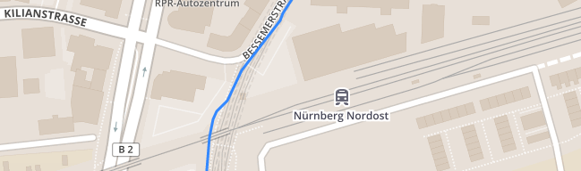
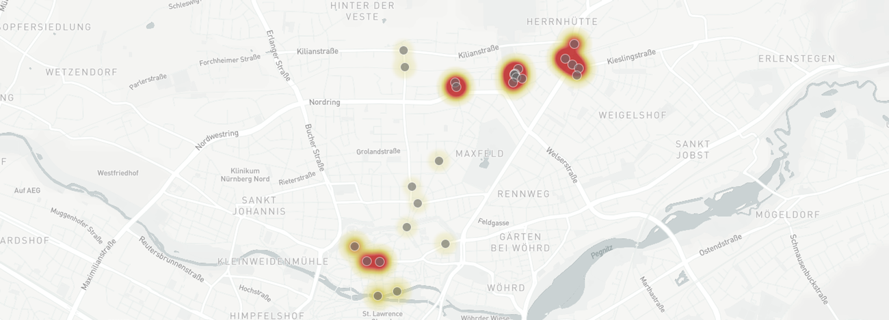

 

Almost two weeks have gone by since the IndieWebCamp in Nürnberg, and as everyone is gearing up for IWC Berlin it is about time I wrote up what a good time I had and what I did.

The good time is simple. It is so energising to meet, in the flesh, with people who have very similar sorts of ideas and who are in addition so much more knowledgeable than I am. Just sitting in on discussions and absorbing what I can makes me feel that much closer to understanding. Being occasionally able to make a useful contribution is also rewarding. Even a couple of days is very worthwhile, and this being my second IWC I felt much more relaxed about knowing the ropes and some of the people.

===

The real challenge comes on the second day, when one is expected to do something -- *anything* -- to improve one's own website. I've been tinkering for a long time with trying to map my walks here, and had made a start, but my main plan was to improve the way that worked. The story so far is that I recently lit on [Trails](https://trails.io) as a good app to record my wanderings[^1] because it offers good data export. By virtue of some deft searching and theft, I had cobbled together a way to display a map of any given walk. At IWC, I wanted to improve the machinery that makes this possible and, if I could, add some extra information that the app offers.

The primary change was to move the script that draws the map and my route through it from the post to the template. That way, I'm not endlessly copying the script from one post to the next and if anything about it needs to change I can do that in one place rather than everywhere. That bit was really rather trivial. I mean, I just copied the script I had over from a test post to the correct template and it just worked. Which was just as well, because the other things I wanted to do took far more time than I expected.

## Making better use of variables

Most of those other things came down to understanding how to persuade Grav to do my bidding. A simple example: the default template Grav uses to build a page is based on the name of the file that contains the main content of the page. In the blog section, to date, that means that every single post is called `item.md` which tells Grav to use the `item` template. I wanted the option to call the file by a more useful name, but still have it use a specific template. All it needs is a value in the file's front matter for `template: walk` but actually making use of that is quite liberating. The same logic applies to other things I might want to change on a per-post basis. So, when it comes to the data for a walk, rather than storing each walk's data with an identical name, so the template knows which file to work with, I can add the filename to the front matter and use a name that means something to me. Again, liberating.

The more difficult task was to extract some additional data that Trails provides, a clutch of different metadata and summary statistics. Mostly, this required a lot of trial and error to work out the structure of the data file and how to get at only the bits I wanted. And that required building up an understanding of how Twig, which is the templating engine that Grav uses, thinks about arrays. I got there in the end, with the name Trails gives the walk, the time at which it took place (I wanted only the date) and an array of summary statistics that I can display with the route. I could pretty that up a bit, but it will do for now.

The challenge with the summary statistics is that Trails does not give me the units for each measurement[^2], so I cannot easily show the units with the number. I've thought of various tricky ways of doing that, but have other, more urgent things to do, so that too will have to wait.

{.center} 

My walk to the IWC

## I do need jQuery

A part of the script to display the route uses jQuery to read the data from the file. People suggested this was not a great idea, if it could be avoided, and even pointed me to the very helpful [You Might Not Need jQuery](http://youmightnotneedjquery.com/). While I don't fully understand why jQuery is not such a great idea, I was happy to at least try to get rid of it. Unfortunately, a straightforward copy-and-paste of the example there gave rise to an impenetrable error. After trying everything I (and my neighbour) could think of, I eventually just gave up. I guess that's a bad mark for me.

## What I learned

The most important take-home this time was the value of sitting next to people who know more than me. Just explaining the problem I was having, helped me to see solutions for myself. Rubber-ducking, but with a real-live human instead of a rubber duck. Thanks to everyone who was so generous with their expertise.

## Future plans

I'd like to learn more about how to put things besides routes on maps. You can enter waypoints in Trails; I need to investigate how those are stored and what I might be able to do with them. It would also be immensely cool to automatically place photographs on the map. I can think of a couple of ways of doing this. One would use the time of the photograph to place a marker wherever the route is at that time. The other would extract the photo's geodata and use that to place the marker. I think that would be more fun, more challenging, and more useful for me to solve. I'm also wondering about other ways in which to use variables in the front matter to adjust the way the map or the route displays.

It was also inspiring to see what other people were able to accomplish with location tracking. Not just [Aaron Parecki](https://aaronparecki.com/gps/), whose geo-fu is simply overwhelming, but others whose ability to take Aaron's tools and make new things with them is also close to magic. Given my dreadful memory, I rather like the idea of tracking my whereabouts all the time and being able to ask my site where was I on ... I'm doing the tracking, with [Wanderings](https://wanderin.gs) but not yet doing anything with the data.

{.center} 

Where Wanderings thought I was in Nürnberg

[^1]: Why I want to do that will require a separate post to explain.

[^2]: They're all metric, obvs.