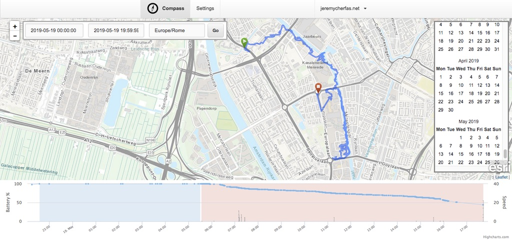

Another absolutely brilliant IndieWebCamp, this time in Utrecht. By now I feel like a bit of an old hand, and it was nice to see old friends and make new ones. The first day, as usual, was devoted to group-organised sessions on different topics.

===

I was particularly taken with Julia Jannson's presentation of her work on The Attention Fair. This emerged from an "art school" project to bring to the surface just what people supply with their ordinary, everyday behaviour on and offline. Julia had developed a series of games and installations that illuminated the value, to others, of the things people do and say about themselves. Rather than attempt to summarise, far better to just send you off to explore <a class="u-in-reply-to" href="http://theattentionfair.com/" >the Attention Fair website</a >. 

One of the more interesting aspects of Julia's work is that while most of us in the room marvelled at her clever creations, not much of it was a surprise. That's decidedly not the case for "the public". Most of them, Julia said, were entertained by her work but thought it was a jolly good science fiction project, maybe a bit like Black Mirror. That it is real, they find truly shocking. And while the value Julia put on different sorts of information was strictly fictional, it would be interesting to know just how much advertisers were willing to pay for specific sorts of pattern. The data are there. But is there any independent research that makes use of them?

The hack day, on Sunday, was also marvellous for seeing what smart people are capable of and for pushing my own boundaries. I had resolved to install <a class="u-mention-of" href="https://github.com/aaronpk/Compass" >Aaron Parecki's Compass GPS tracker</a > on my own server. I like the idea of knowing where I've been, but previous attempts to get hold of this data on my own website have been just too complicated. Compass offers an essentially friction-free experience for gathering basic location data. I got pretty far along all on my own, thanks to Aaron's clear instructions, and then ran into a brick wall. Thankfully, more knowledgeable minds than mine were available on hand, and with help from Rose and Sebastiaan I was able to break for lunch knowing that all was working. I apologise for not documenting all the things they did to divert me around my roadblock; suffice to say that it works for me.

{.center}

Displaying my location more publicly will require more work., although Rose is busy working on a Shortcut that will allow people to share a time-limited link to their actual position. That will be fun and handy. Then I will work on setting fuzzy areas to protect certain locations and figuring out how to display specific routes and trips on my site.

Some fantastic other demonstrations finished the hack day. Martijn built a search engine. Frank built a script to import OPML files into an indie reader. Björn made a thing that scrapes the cover art and summary of a book from one of several sources. Dylan cleaned up his site and reviewed his travel coffee maker. Johan created a Docker container for Aperture; I haven't the faintest idea what that entails, but I know that it is difficult and important. Rose and Sebastiaan worked on Seb's reader map. Julia worked away but is saving the reveal for later. 

It was also gratifying to see Rose take my script for sucking up podcast listen s from Overcast and, first, tidying it up (though I wish I had a slo-mo recording of what exactly she did)[^1] and then actually using her version to get a list of the podcasts she had listen ed to. I learned a huge amount about giving, taking, and sharing.

[^1]: And it was super interesting to note that Ton had <a class="u-in-reply-to" href="https://www.zylstra.org/blog/2019/05/watch-and-learn/" >an exactly similar experience</a >. Watching someone work, especially if they slow down to help or, even better, having them watch you, is clearly a worthwhile practice.

Great thanks to Frank and Tonz, who organised it all, and to Johan for hosting in his very funky space at Shoppagina. And also to all the other people there, every one of whom gave me something to think about, and many of whom gave me far more help and encouragement than they realise.

!!! [The event page](https://indieweb.org/2019%2FUtrecht) has more details, including other write-ups.