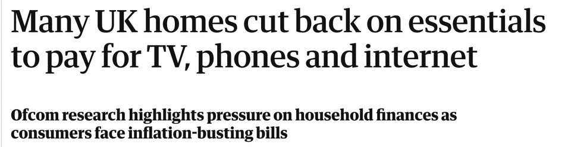
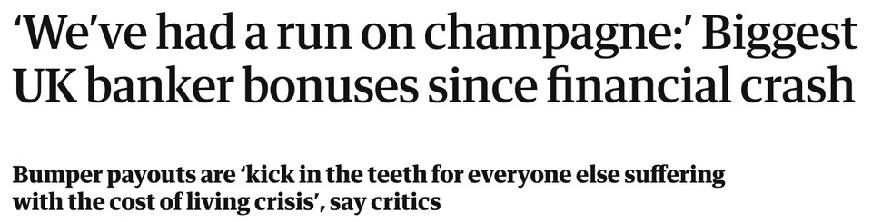

Over on Eat This Podcast I’ve been splitting hairs over whether inequality or straightforward poverty is to blame for people not being able to afford food. Then along comes a day that serves up a perfect illustration.

{.center}

{.center}

Those two headlines are from the online edition of this morning’s Guardian. The [first tells us that](https://www.theguardian.com/business/2022/feb/15/uk-homes-cut-essentials-to-pay-for-tv-phones-and-internet):

> Up to a fifth of UK households have struggled to pay their TV, internet and phone bills in the last year, with some having to cancel services or cut back spending on essentials such as food and clothing to make payments, according to research by Ofcom.

[The second](https://www.theguardian.com/business/2022/feb/16/weve-had-a-run-on-champagne-biggest-uk-banker-bonuses-since-financial-crash) starts like this:

> This week British bankers will start collecting the biggest bonuses since before the 2008 global financial crisis as their employers fight an “increasingly intense war for talent”.  
> As most Britons face the biggest squeeze on their incomes since at least 1990, already very highly paid bankers are celebrating “particularly obscene” bonuses in the City’s pubs and wine bars.

It would be easy to say that poor people should put food ahead of internet, but that would be plain stupid. Access to the internet is an essential these days. The tragedy is that people do not seem to be taking advantage of something called social tarriffs offered by broadband providers in the UK. I didn’t even know that such a thing existed — why would I? — but it does, and only 1.2% of eligible households are signed up, which the Guardian says could halve their bills and save £144 a year.

As for the *ankers, they are set to share “bonuses totalling more than £4bn”. Of course they will all pay tax on their bonuses, and of course the UK government will use that tax income to support the people who cannot afford to buy food and phone time. In the meantime, I wonder if any part of those bonuses will find its way directly to people in need.
