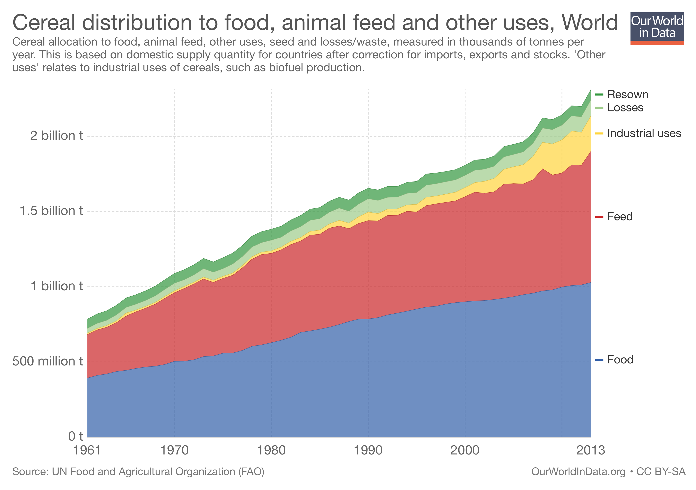
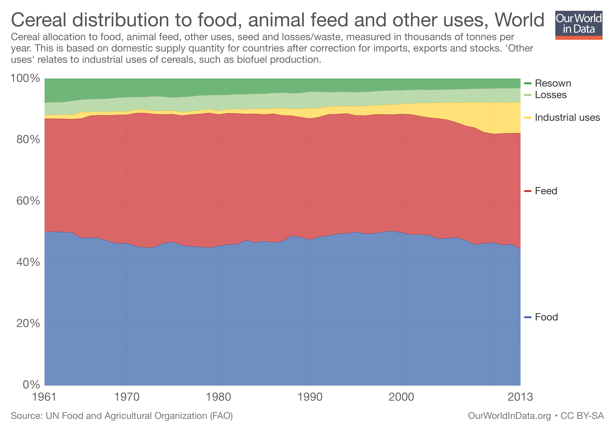

There was a teeny squawk on Twitter today when Tim Lang shared a graph of how the global harvest of cereals is divided up.

<blockquote class="twitter-tweet" data-lang="en">
Look how use of cereals to feed animals has grown:
&mdash; Professor Tim Lang (@ProfTimLang) <a href="https://twitter.com/ProfTimLang/status/958288726202908672?ref_src=twsrc%5Etfw">January 30, 2018</a></blockquote>

This is the graph he showed:

{.center} 

My old mucker Luigi was quick to point out that the same graph could be expressed as percentages of the total yield, and that shows a very different picture.

{.center} 

The actual numbers: 

> 1961: feed 36.86% Food 50.07%. 2013: feed 37.77% food 44.49%. Industrial uses climbs from 1.22% to 10.15%.

Feeding animals cereals that humans could eat is a problem, I agree, but in percentage terms, the growth of cereals as an industrial feedstock -- biofuels, presumably -- is far more worrying.