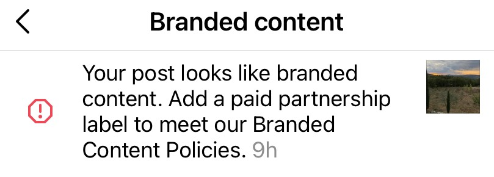
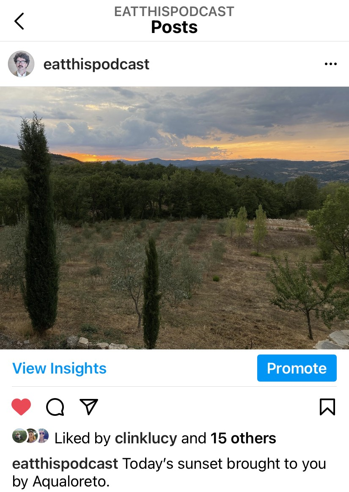

It really is hard sometimes to understand the idiocy of artificial intelligence or machine learning or whatever the flavour of the day is today. This morning, I was slightly alarmed to see a warning from the Instagram gods, to whit:

{.center}

It seems to think my post “looks like branded content” and suggests I need to add some sort of label to comply with its policies. The post in question:

{.center}

So yes, it contains the phrase “brought to you by” but you don't have to be a linguistic genius to work out the image certainly is not branded content.

Do I, though, actually need to take this up with the Instagram gods, or can I just ignore it and hope not to get banned? Although, being banned for something as dumb as this would make a good story.
