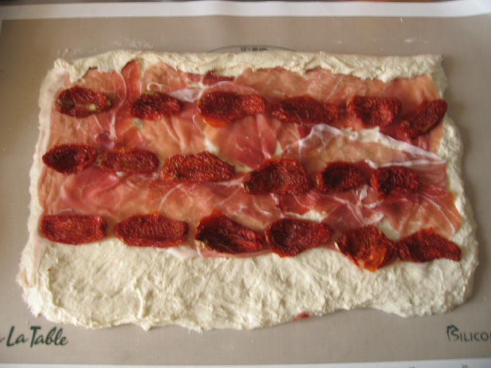
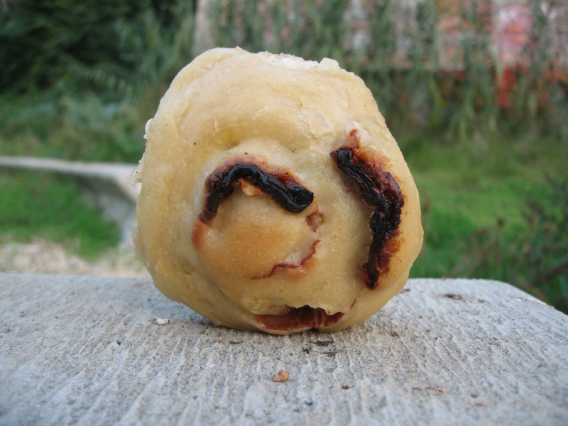

 

! Originally published on 24-11-2009. Relevant to having dug up the post about my centenarian Italian sourdough starter, and resurfaced here partly to goad me into trying it again so that I can repost on Fornacalia.com. There are definitely changes I would make to the recipe and the method.

{.center} 

===

When I joined the [secret confraternity of home bread bakers](/blog/stories-to-savour) back in the summer [of 2009], the restaurant Necci 1924 fed us a remarkable lunch to tide us over the rising of the bread. Among the items was the most delicious kind of savoury Chelsea bun, a spiral confection of soft bread, prosciutto, tomatoes and, maybe (though I don't remember) herbs like rosemary. I ate my fill, and lusted after more. But I didn't know what they were called. So I threw myself on the assembled wisdom of [The Fresh Loaf](http://www.thefreshloaf.com/node/14353/i-want-recipe-something-and-i-don039t-even-know-what-it-called), where Scott Hall emerged from the chaos with some recommendations.[^1]

[^1]: Looking back now, the specific comment seems to have vanished. I have asked why.

So I did it, based on the recipe in Dan Lepard's Exceptional Breads but using my starter and only half quantities.
    
````    
150 gm white starter at 100% hydration
390 ml warm water
500 gm grano tenero 0
10 gm salt
1/2 tsp demerara sugar
25 gm olive oil
100 gm prosciutto
100 gm sun-dried tomatoes
````    
In a large bowl, I mixed the water with the starter, then stirred in 250 gm of the flour. I covered the bowl and left that to get going, about 4 1/2 hours.

Added 25 gm of olive oil (as per Scott's suggestion of 5% oil) then tipped in the remaining 250 gm of flour, the salt and the sugar. In the absence of the mixer Dan's recipe calls for I did a stretch-and-fold every 10 minutes for an hour.

I spread the dough out into a rough rectangle on a silicone mat and placed a layer of prosciutto on top, leaving about the bottom third clear along the long edge to seal it. Then striped the sun-dried tomatoes across the dough.

Rolling the dough up wasn't as hard as I expected, using the silicone scraper carefully. I transferred it onto a floured wooden board and sealed the seam as best as I could. Then sliced it into 12 rounds, which I transferred to an oiled baking tray, leaving space between them to allow for expansion. Next time I might try packing them in a little closer, even at the risk of them joining together.

Covered with a cloth and allowed to rise for about an hour, then into an oven at 220 ℃ for 25 minutes.

On removing them from the oven I brushed them again with more olive oil, going over them three times in total.

{.center} 

And that's it. You can see the [whole set of photos here](https://www.flickr.com/photos/jcherfas/albums/72157622739037649). Were they as good as the ones at Necci? I don't honestly know. May have to go back there soon. Were they good? You bet; gently chewy with the flavour of the ham and some bites intense with salty tomato. Definitely best warm, and they reheat brilliantly in a dry skillet over a low flame with a lid on.
