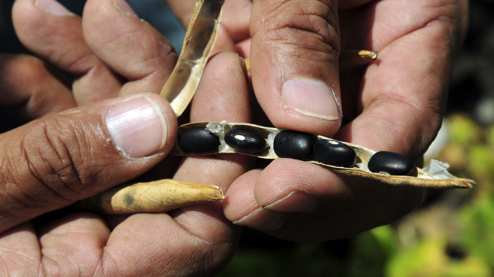

! One of the nicest things about publishing our recent paper [What is Wrong with Biofortification](https://www.sciencedirect.com/science/article/abs/pii/S2211912423000196) is that it prompted several people to share results and opinions that support our conclusions. Confirmation bias aside, we have not yet had any substantive pushback. This piece was prompted by one of the responses we received.

{.center}

See those beans? They are “iron-rich”. Why the “scare quotes”? Lots of reasons, some trivial, some much less so.

===

First, the trivial. The [photo itself](https://www.flickr.com/photos/ciat/5037555633) does not come with much information, only that it shows “Biofortified beans at CIAT’s headquarters in Colombia” and that it was taken in 2010 by Neil Palmer. CIAT is an international agricultural research centre that undertakes plant breeding and other research in support of developing countries.

The beans might be fortified with zinc, because CIAT did that too. And they might not be biofortified or iron rich, because you simply cannot tell just by looking, which is another problem entirely. But Neil Palmer is an honest chap, and a fine photographer, so let’s just accept that they are iron-rich beans.

The less trivial reason that calling CIAT’s beans iron-rich is a problem, I learned about from Professor Raymond Glahn, a nutritional physiologist with the USDA at Ithaca, NY, who sent me a couple of his papers after reading our recent paper on biofortification.

Backing up a bit, the reason CIAT set out to breed iron-rich beans is that iron-deficiency anaemia remains a big problem in Africa and elsewhere. If you could increase the amount of iron in beans, an important staple crop in, for example, [Rwanda, where about 38% of children and 18% of reproductive-age women are anaemic](https://ourworldindata.org/micronutrient-deficiency), obviously you could make good the deficiency of iron. Hence the push to breed biofortified beans.

## Iron-clad measurements

Glahn and his colleagues[^1] examined two large collections of bean samples; 76 formed the East African Market Collection, bought, unsurprisingly, in good markets in East Africa, while 154 came from breeders in the Pan-Africa Bean Research Alliance, which CIAT supported to breed improved bean varieties. For the market beans, 18 were biofortified, while for the breeders’ beans, 35 were biofortified.

[^1]: Raymond P Glahn, Jason A Wiesinger, Mercy G Lung'aho (2020) Iron Concentrations in Biofortified Beans and Nonbiofortified Marketplace Varieties in East Africa Are Similar. [*The Journal of Nutrition*, 150: 3013-3023](https://doi.org/10.1093/jn/nxaa193).

Iron concentrations in the four groups (market, breeders; biofortified, not biofortified) were remarkably similar. There was no difference between biofortified and non-biofortified beans in the market. The average for both was 71 μg/g.[^2] For the breeders, there was a statistically significant difference, with biofortified beans averaging 73 μg/g while non-biofortified beans averaged 63 μg/g.

[^2]: Parts per million, if you prefer.

The really interesting discovery, in my view? **No significant difference between the breeders’ biofortified beans and non-biofortified beans bought in the market.**

## So what

All the work put into breeding biofortified beans was based on an assumption that the beans eaten by people in Rwanda were low in iron. The figure quoted in arguments for biofortification was 50 μg/g. But that was purely an assumption. Glahn’s measurements show that even back around 2000-2004, when the big push for biofortified beans started, the average was around 70 μg/g. Biofortifiers “simply never checked” iron levels in the regions they targeted, Glahn told me.

Glahn and his co-authors summarise:

> [I]n over 15 y of effort to provide beans with substantially higher Fe [iron] content to locations in East Africa, this study finds no evidence of success in doing so.

Note, though, that this may not apply to projects to introduce high-iron beans in Central and South America, where similar studies have not yet been carried out.

And, somewhat cautiously:

> Claims that “iron beans” are a nutrition success story in countries such as Rwanda are not supported by the observations of this study.

That raises a couple of rather tricky issues.

If the iron-rich beans are no richer in iron than the beans commonly available in the market, why is iron-deficiency anaemia so high? Maybe biofortifying the beans was never the answer. In which case, what, really, was the reason for plugging money into the project? And why didn’t anybody ask this kind of question at the outset?

## What now

There might well be other ways to improve the iron status of people in places like Rwanda. One of the complications of iron and beans is that the seed coat of the bean contains compounds that can both inhibit and enhance the absorption of iron by the body. Beans with a yellow seed coat, for example, tend to be associated with greater bioavailability than beans with a dark red or black coat. [A trait known as “fast-cooking”](https://acsess.onlinelibrary.wiley.com/doi/epdf/10.2134/csa2016-61-5-1) is also associated with high iron bioavailability, independently of seed coat colour. A fast-cooking black bean offers greater iron bioavailability than a slower cooking black bean, but a black bean generally provides less iron than a yellow or white bean. Biofortification has not, as far as I know, targeted fast-cooking as a desirable trait, even though the women who cook beans for their families are very keen on the trait.

If households could be encouraged to favour fast-cooking beans, and breeders could be encouraged to select for fast-cooking without neglecting iron, that might have a greater impact than spending time and money breeding “high-iron” beans that are actually no higher in iron that those already available. Or maybe, we need to look beyond beans entirely.

## Go fish

I’m old enough to remember early trials of the Happy Fish, a fish-shaped ingot of iron that you put in the pot while cooking something else. It [raised iron levels in women and children](https://luckyironfish.com/pages/clinical-research), and has since evolved into a [Lucky Fish](https://www.smithsonianmag.com/innovation/lucky-fish-could-save-lives-180955818/) and a Lucky Shakti Leaf (for veg*ns?). I wonder how that’s going?

! Syndicated to <a href="https://www.eatthispodcast.com/iron-beans" class="u-syndication">Eat This Podcast</a>
