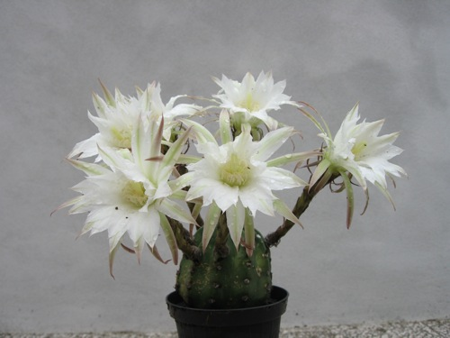
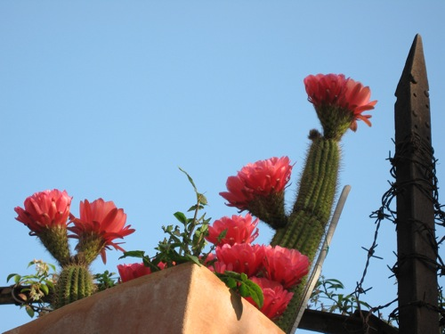

After three days of almost incessant rain, I got up one morning to find that one of my cacti had gone berserk.

{.center}

And just as suddenly, a couple of days later, all those flowers were limp and dessicated. That set me to wondering about the synchrony of flowering in cacti. Many are pollinated by birds and bats, which presumably are not going to check every day to see whether there are any treats in store.

So, particularly if it is generally an outbreeder, it would pay a plant to flower in synchrony with other individuals, creating a decent-sized signal for the pollinators. There’s some evidence that this is true, for some species, but on a quick scan I haven’t found anything definite or general.

I take some care of my cacti. Next door, perched on top of a gate post where I guarantee it gets no care whatsoever, is a considerably larger, different cactus. A morning or two after mine it too went crazy.

{.center}

What a perfect, brief treat.
