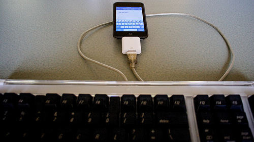

My friend the vombatovore and I have an ongoing thing about how utterly useless most (all?) netbooks are for people who touch type. Maybe people with long, slender digits are OK with small keyboards, but I’m not, and neither is he. In fact, I donÆt really need the screen, except for reviewing. But I do need a good keyboard. Which is why [I hanker after my old TRS-80-100 or a new Neo](https://jeremycherfas.net/blog/back-to-the-future-again/) or some such.

Anyway, this morning I happened on this article, which tells how [Macheads are installing OSX on Netbooks](https://web.archive.org/web/20081218094658/http://gadgets.boingboing.net/2008/12/17/osx-netbook-compatib.html). And one of those netbooks might just have a decent keyboard. So I sent it to my friend, who is far techier than I am, and within an instant he had posted a long screed about -- yes -- how lousy the keyboards on netbooks are and [how he had bought Yet Another (proper) Laptop](https://web.archive.org/web/20140311035146/http://wombatdiet.net/2008/12/18/its-the-keyboard-stupid/).

I misspoke myself in a comment to that, saying I wanted a wifi keyboard that would work with my iPod Touch, leading him kinda sorta to miss the point and tell me that there was no Bluetooth on the iPod Touch, so my wait would be in vain.

What I really want is this:

[{.center}

I found that on a [tantalizing blog post](https://darcynorman.net/2008/07/23/ipod-touch-keyboard-add-on/) but it turned out the torturer-in-chief had simply mocked it up with a (wired) keyboard and connector. But a question remains.

Why is there nothing like this? I've heard all sorts of reasons, like, it would deplete the batteries too fast (so add external batteries to the keyboard) or that it would cannibalize sales of the Airbook (puhleeze).

The thing is, all the bits already exist. So, from a position of profound ignorance, how hard would it be, really, to write an application that would accept text input from the keyboard?

There’s a fortune waiting.

!!! 2021-12-18: It didn't actually take that long. I now have an (old) Logitech Bluetooth keyboard that types just fine on my phone. I don't use it for that.

