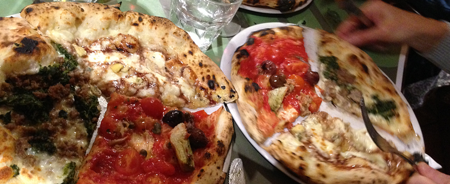

There is, apparently, a huge difference between pizza made in New York and pizza made elsewhere. So I learned on a podcast I listen ed to this morning, and I confess, I've heard the same said of New York bagels. The folk belief is that it must be something in the water. The podcast went on to explain in loving detail how someone conducted a trial of different waters, decanting store-bought waters into plain bottles, numbering the bottles and having his wife switch the numbers. Oooh, double-blind. Science! Then schlepping the whole lot off to a great pizza restaurant to conduct the tasting. [And you know what][seriouseats]:

> As far as pizza goes, use whatever water you want. ... Clearly, the small differences that arise naturally in the course of making a good pizza by hand far outweigh the minor differences that water could make.

===

Which I guess was a disappointment.

 {.center}

My approach would have been very different. I would first want to test the primary claim. Is there, actually, any difference at all between New York pizzas and those made elsewhere? Can people who say there is a difference identify a New York pizza in a line-up? 

I'd take the New York pizzaiolo to some location outside New York, somewhere that has recognizably different pizzas. Say, Philadelphia. In a pizza restaurant there I'd ask the New Yorker and the local guy each to make a batch of dough, using Philadelphia ingredients. Then I'd take both of them and their doughs back to New York and have them each make a batch of dough using New York ingredients. Ideally, and I think this would be worth the extra effort, you would choose two restaurants that use the same flour. At this stage, you get super-scientific and have a third pizzaiolo make the pizzas, unaware of which dough is which. That's the double-blind part. Now comes the super easy part.

Instead of having people rate the pizzas on a 10-point scale for four different qualities, you simply ask lots of people who have previously claimed that New York pizza is different, which is the New York pizza? They don't even have to think it is better, just different, so you can repeat the experiment in Philadelphia. And if more than eight people get it right, you actually have something worth investigating. 

Then we can start talking about what, if anything, is the reason for the difference.

*P.s. The photo is from [a pizza jaunt we undertook here in Rome][jeremycherfas] back in January 2013.*

[jeremycherfas]: http://www.jeremycherfas.net/blog/pizza-worth-a-detour
[seriouseats]: http://slice.seriouseats.com/archives/2010/01/does-nyc-water-make-a-difference-in-pizza-quality.html