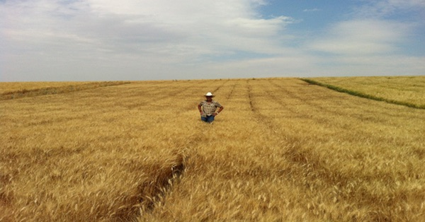

{.center}

Durum wheat is only about 5% of the total wheat harvest around the world. For those of us who like our pasta, that’s a very important 5%. Different gluten proteins make a durum dough stretchy rather than elastic — perfect for pasta. The kernels are very hard and need dedicated milling machinery, which produces small granules — semolina — rather than flour. That, however, may be about to change.

<a href="https://www.eatthispodcast.com/our-daily-bread-29/" rel=canonical>Listen to It’s a Hard Grain at Eat This Podcast.</a>