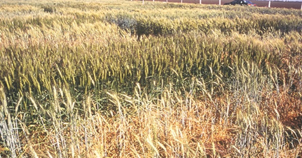

{.center}

Wheat has a hugely diverse genetic background, being made up of three different species, and genetic diversity is what allows breeders to find the traits they need to produce wheats that can cope with changing conditions. But because the accidents that created wheat might have happened just the once, plenty of diversity that is missing from modern wheats is still in wheat’s ancestors. Trouble is, crossing a wild wheat with a modern wheat is almost impossible. Solution: remake modern wheat.

<a href="https://www.eatthispodcast.com/our-daily-bread-11/" rel=canonical>Listen to It’s not natural at Eat This Podcast.</a>
