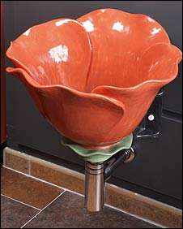

{.center}

A friend kindly linked me to the BBC's "news" [story of floral urinals](http://news.bbc.co.uk/2/hi/uk_news/england/lancashire/7515513.stm) at a garden centre in Lancashire. I was briefly amused, and thought, well, they've got their bit of publicity, and no mistake. I'm not adding to it.

But the trouble with being a magpie collector of unconsidered trifles, and a quasi-botanist, is that I instantly wondered whether the sculptor, Clark Sorensen, had made the obvious link and put a bee in his urinals. Why? Two reasons. First, legend [^fn1] has it that a thrifty manufacturer of urinals placed the bee on the porcelain and then an extra thick bit of glaze there, reasoning that men would aim at the bee (they do) and that the extra glaze would absorb the impact, prolonging the life of the urinal. Secondly, according [a genuine internet fact](http://www.coathanger.com.au/archive/dibblys/loo.htm), giving men something to aim at reduces spillage by 80%. The Dutch, whose research this was, however, missed the point of the original bee in the urinal; it was a pun. The Latin for bee is _Apis_. Geddit? Apis, a piss.

Anyway, I figure a fly or a bee in a plain white urinal has a lot of class. But in a flower? Perfect! Alas, Mr Sorensen says nothing about the decor within his florinals. He [does say](http://www.clarkmade.com/) that "while these pieces are primarily intended as works of art, they are also fully functioning vitreous porcelain fixtures that can be plumbed and used, in fact, the artist encourages it!" which I suppose is a good thing.[^2]

[^2]: 2021-07-22: Or did; I can't now find the quote, but at least the site is still there.

He's also not mad keen on people using his images without express written permission, which I don't currently have time to seek. So I'll just say that if some house beautiful fairy were to wave her magic wand and grant me just one wish, it would be for the [Calla florinal](http://www.clarkmade.com/images%20urinals/Calla%20front.jpg), with its sumptuous white bowl and erect yellow spadix. Aiming at that would surely create splashback with a vengeance.

So aside from urinal envy, I'm wondering whether the garden centre is making the most of its expensive _pissoirs_. It's own web site makes no mention of its new blooms, so I don't know whether there are handy fact sheets above the urinals details the symptoms of nitrogen deficiency and how to remedy it. Or what about the use of night soil to activate the compost heap? Heck, if I were that garden centre, I'd be collecting all that valuable waste and using it around the premises, and blowing my green trumpet. But perhaps neither customers nor the BBC would actually want to know about that.

While researching this post, I discovered some further unconsidered trifles to hoard. A recent blog post (~~http://www.nathanverrill.com/art-and-design/2008/06/28/you-rock-urinal-fly/~~)[^3] credits Brian Eno with drawing attention to the Dutch flies. It shows exactly where to position the fly for maximum effectiveness, courtesy of a supplier of [stick-on flies](http://www.urinalfly.com/). Then there's [urinal.net](http://www.urinal.net/). And there I was thinking to ignore the BBC's silly season story. Thanks Gail!

[^fn1]: I say legend because I have not been able to trace this on the intertubes, and obviously my own memory counts for nothing. 

[[^fn2]: So I used the image I found [here](http://www.deluxeblog.it/post/1595/orinatoi-a-forma-di-fiore-by-clark-sorensen). 

[^3]: 2021-07-22: Rotted.
