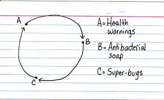

{.center}

It occurs to me, after the event, that this post’s title is also appropriate to [Jessica Hagy’s indexed card](https://indexed.blogspot.com/2007/12/scrub-that.html) I’ve copied. One of the hard parts of catching up after being away is deciding what to delete, unread, what to read now, and what to delay. Indexed is always a read now, not least because it takes so little time and is so rewarding. And I’m not going to labour the point about antibiotics and the tragedy of the mismanaged commons. I suppose I could go ahead and link to the things I actually read. Like Zeldman's jaundiced view of [self-actualization, web 2.0 style](https://www.zeldman.com/2008/01/03/self-publishing-is-the-new-blogging/). Or a couple of sips from the Language Log firehose: one on [spoof scientific papers and the credulity of “science” reporters](http://itre.cis.upenn.edu/~myl/languagelog/archives/005246.html) (two subjects dear to my heart) complete with [sledgehammer-nut follow-up](http://itre.cis.upenn.edu/~myl/languagelog/archives/005261.html). Paul Butz [excoriates Adobe](https://photomusings.wordpress.com/2007/12/28/a-modest-proposal-for-adobe/), “the company that's blazing new trails into the land of ‘We Pissed Off Our Customers Because We’re Arrogant Asshats’”.

Now I better get back to work, leaving 19 items delayed.
