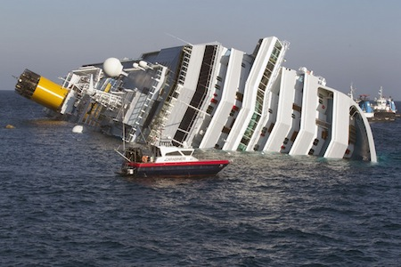

{.center}

> S&P’s hammerblow arrived at almost exactly the same time yesterday evening as the huge Italian cruise liner “Costa Concordia” went aground and then keeled over. It would be tempting to use the ship as a metaphor for the Italian economy: grand, immobile, half-sunk, a wrecked fun palace with some casualties (thankfully relatively few) and thousands shivering in the winter night. Even the ship’s name has ironic resonance in a country known for discord.

[James Walston](http://italpolblog.blogspot.com/2012/01/ratings-and-lexicographers-quandary.html) draws the metaphorical connection more eloquently than I could.
