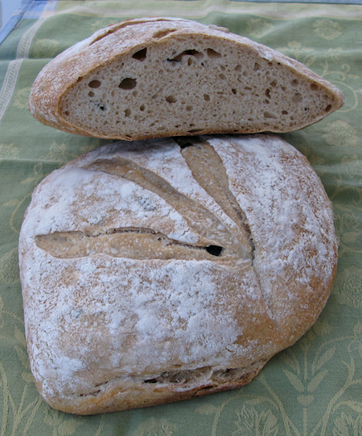
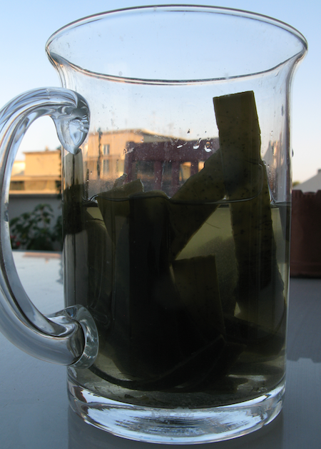
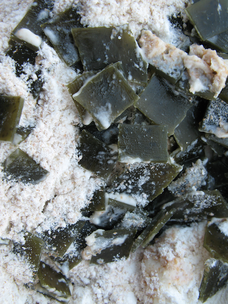
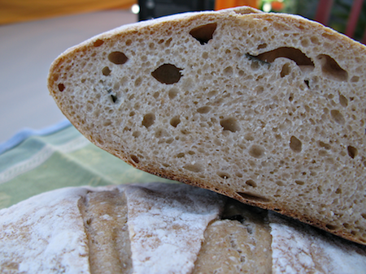

{.center}

Catching up with podcasts, there was an intriguing bit in The Food Programme episode [Seaweed, a forgotten food?](http://www.bbc.co.uk/programmes/b01h2kvg). A baker [^fn1] said she regularly put seaweed in her breads, and that it added a good meaty note of umami. I remembered an old packet of dried kombu sitting in a drawer. Bingo.

Rather than simmer the kombu, I cut a sheet into strips and put them in a Thermos with 250 ml of boiling water, leaving that to steep overnight. Next morning, the biggest surprise was the elongation of the strips. It's a wonder kombu -- unlike some other "sea vegetables", a ghastly phrase -- doesn't have a reputation as an aphrodisiac. A negligible sheet of crinkly paper-like kombu had turned into 40 gm of long slithery strips of lovely greenish seaweed.

{.center}

_Kombu the morning after a tepid soaking. Look how long it is!_

{.center}

_Bits of soaked kombu chopped into the dough._

I cut those into smaller pieces, tipped them and the 210 gm of seaweed liquor into my usual mix (20% wholewheat, 65% hydration, 28% starter) and gave it a perfunctory stretch and fold. The only change to the recipe was to reduce the salt from 15 gm to about 8 gm. One hour bulk fermentation at room temperature, then into the fridge for 12 hours. Shaped, proved for 90 minutes, then into a 430°F oven with steam for 22 minutes. Another 22 minutes at about 410°F without steam, and then cooled on a rack.

The crumb and crust were as expected, the taste subtly different, at least to me. It did seem to have a bit more heft or body. Or maybe that's just because I was anticipating something different.

{.center}

_Kombu bread; the obligatory crumb shot._

Will I do it again? Yes, I think so. Later that day, with some fresh tomatoes, I definitely felt that there was more flavour to the bread.

Uncharacteristically, I did not research this idea to death before plunging in. And I'm glad I didn't. Over at The Fresh Loaf are all sorts of [recipes that involve seaweed](http://www.thefreshloaf.com/searchresults?cx=partner-pub-5060446827351852%3A9bvu1n-clx1&cof=FORID%3A9&ie=ISO-8859-1&cow=seaweed&sa=Search&siteurl=http%3A%2F%2Fwww.thefreshloaf.com%2Fnode%2F29145%2Fsourdough-duram-atta-bread-%25E2%2580%2593-pharaoh%25E2%2580%2599s-mastaba-style), but none for kombu or kelp specifically. And there are other recipes elsewhere. All I can say is, mine worked, with thanks to The Food Programme for the inspiration, and my dusty store drawer for the wherewithal.

I'm sending this to [YeastSpotting](http://www.wildyeastblog.com/category/yeastspotting/) too.

[^fn1]: I wasn't listening hard enough, didn't make a note, and am currently too pressed for time to listen again. 
