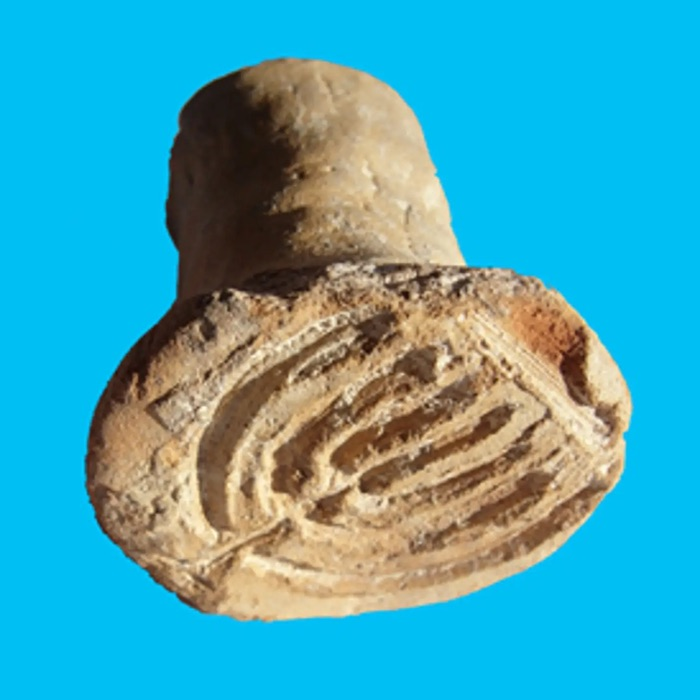
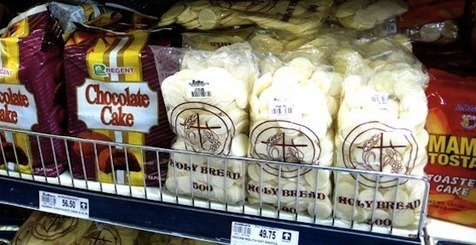

Of course the human brain is wired to notice coincidences, and of course this is no more likely than any two topics turning up on the same day, but I did happen to notice two bready stories with a religious theme.

{.center}

> The tiny stamp was used to identify baked products; experts think it belonged to a bakery that supplied kosher bread to the Jews of Acre in the Byzantine period.

Original article: [Israeli archaeologists find 1,500-year-old kosher ‘bread stamp’ near Acre](https://www.haaretz.com/1.5162385)

{.center}

> How the communion wafer arrived in the capitalist marketplace.

And became food. “[P]rior to consecration, the host is only bread.”

Original article: [Buying the Body of Christ < Killing the Buddha](https://killingthebuddha.com/mag/buying-the-body-of-christ/)
