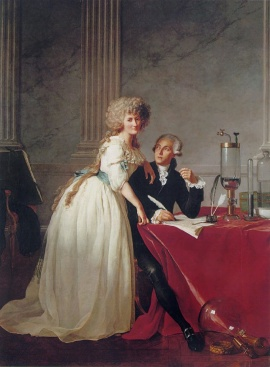

{.left}

I was momentarily distracted while listening to [Lord Bragg](http://www.bbc.co.uk/podcasts/series/iot) on Women in Enlightment Science trying to recall whether I had ever seen the famed double-portrait of the Lavoisiers. So as soon as I got to the desktop I went looking, and I don't believe I had. My original intention had been to just nick the image, but the blog I found it on is interesting enough to merit credit. Thanks.

[ExecutedToday.com » 1794: Antoine Laurent Lavoisier, father of modern chemistry.](http://www.executedtoday.com/2010/05/08/1794-antoine-laurent-lavoisier-father-of-modern-chemistry/)