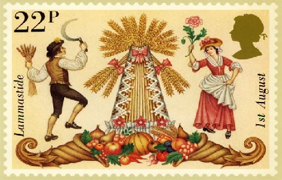

{.center}

Lammas day is something I had been vaguely aware of growing up, but it wasn’t until about 15 years ago that I started to understand its full significance. It is [Loaf Mass Day](https://en.wikipedia.org/wiki/Lammas).

> On Loaf Mass Day, it is customary to bring to a Christian church a loaf made from the new crop, which began to be harvested at Lammastide, which falls at the halfway point between the summer solstice and autumn September equinox.

Here in Italy, most of the wheat was harvested weeks or months ago, yet in England, [much of it stands unripe](https://www.fwi.co.uk/arable/harvest/grower-kick-starts-wheat-harvest-to-earn-30-t-premium) yet in the fields. So what’s going on? John Letts, who grows ancient wheat varieties in Oxfordshire, says we can blame the disconnect on the 12 days lost when we shifted to the Gregorian calendar in 1752. As with daylight saving time, one could argue that August 1st is “really” August 12th. As John [explains](https://www.sustainweb.org/realbread/articles/aug19_local_loaves_for_lammas/):

> [T]he start of the harvest a couple of centuries ago was August 11th. The first crops to be harvested (with sickles) were rye and mixed wheat and rye (maslin), followed by pure bread wheat (rye ripens 1-2 weeks before wheat). This was followed by the barley and oat harvests (usually with scythes) in late August and September, and then by the reaping of rivet wheat (again with a sickle) in September (rivet is very late to ripen).

> Over the past century, as a result of plant breeding, the ripening time of wheat has moved forward by about two weeks (and of barley by much more than this). Wheat is now ready to combine at the end of July/early August (weather permitting), but not always on 1st August.

To be truthful, I would never have remembered Lammas Day had it not been for my new habit of reading old posts from this day in previous years. That surfaced my first attempt to [recreate a nice light Jewish rye with caraway seeds](https://jeremycherfas.net/blog/coming-to-the-rye-part-i).[^1] And that was almost certainly prompted by a post from the Real Bread Campaign, which was attempting to resurrect Lammas Day traditions. As far as I can see, that has not happened, at least not noticeably. 

As you can tell from my irreverent use of a Christian celebration to bake a Jewish rye, the formal religious aspects of Lammas Day mean nothing to me. The spiritual value, however, of giving thanks for a harvest safely brought in, is immeasurable, and deserves some sort of recognition.

Fornacalia, Pasta Madre Day, Lammas Day; none of them seems to have caught fire, and to me that’s a shame.

[^1]: A version of which is now a standard part of my repertoire.