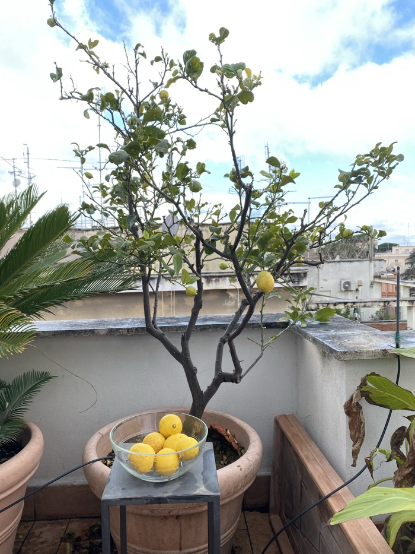
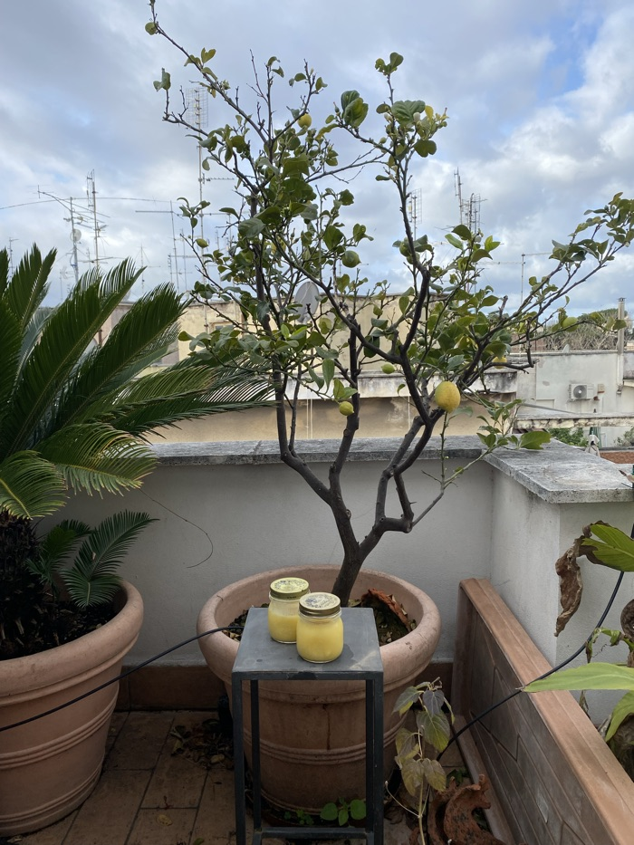
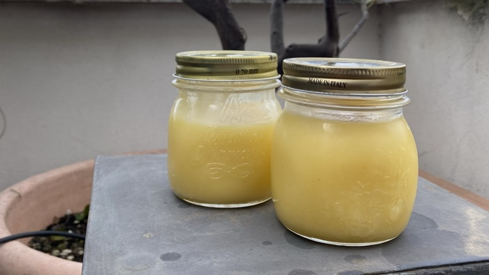

Our lemon tree has had quite a few lemons hanging on it since before Christmas and they currently look like very sad decorations. It would be too easy to say make lemonade, but it’s cold outside and drizzly. and in any case the lemon tree won’t wait much longer. Time to do something about that.

{.center}

I have two scraps of paper with identical brief instructions. Zest and juice of four lemons, four eggs, four ounces of butter and 12 ounces of castor sugar, heat over a double boiler.

Simple enough you might say, and simple indeed. The thing is, neither tells me how long to cook the mixture. It has eggs in it and they need to be cooked to higher than 165°F, for safety. But how much higher? All the online evidence is of two kinds. Either you cook until the mixture will coat the back of a spoon, or until it reaches somewhere between 170° and 180°F. I prefer the certainty of a thermometer.

And so it was. Everything into a basin above a saucepan of boiling water. Stir, stir,stir, take its temperature, whisk whisk, whisk. When you get to about 175°F, pour it through a fine sieve into awaiting glass jars. That last bit is a bit tricky because the zest tends to clog up the sieve, but it isn’t too difficult to keep moving it to one side with a spoon.

And there you have it two lovely jars of lemon curd. 

{.center}

Except that it wasn’t so smooth. Halfway through the whisking  there was an alarmingly loud **CRACK!**, and I could see that the basin had in fact cracked. I had to quickly pick the basin up in gloved hands and tip its contents into a jug. I just made it before the basin cracked in two.

Luckily there is a lovely kitchen shop just 10 minutes walk away and so about 25 minutes later I was back in the kitchen with a new Pyrex basin. Test again. Stir stir, stir again. And once again sieve it into the jars.

{.center}

Later that evening we each had a spoonful (from the jar in the back) over vanilla ice cream and it was sensational.
