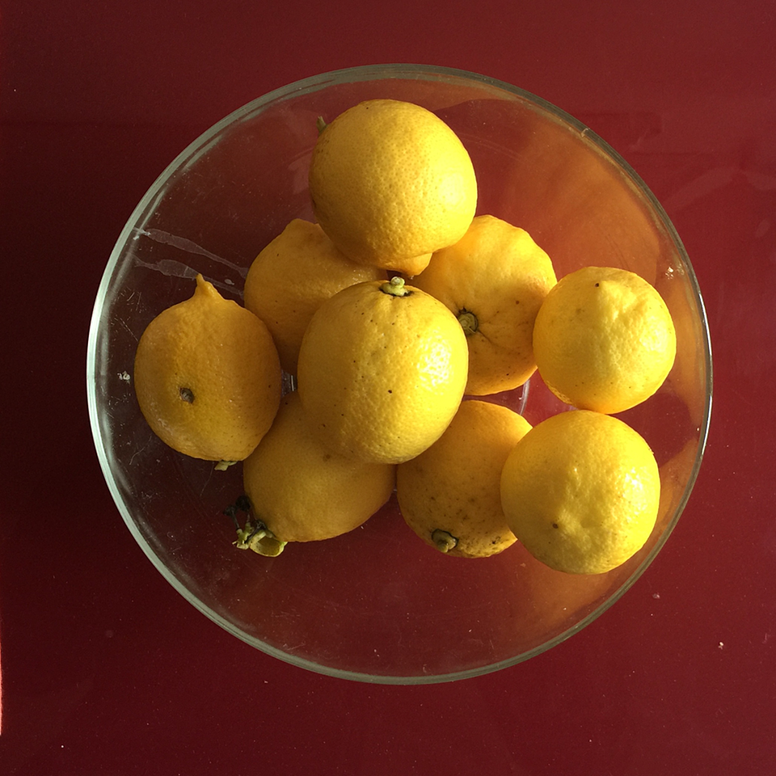
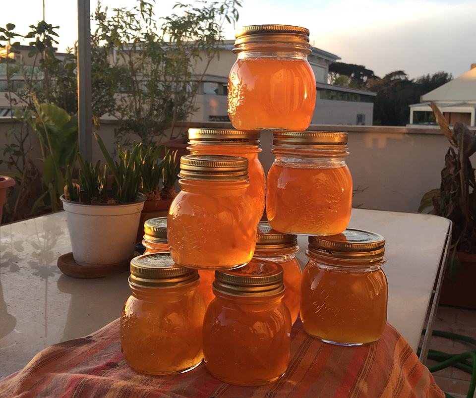

---
title: 'Lemon marmalade'
published: true
date: '23-01-2018 13:00'
taxonomy:
    category:
        - blog
    tag:
        - General
summary:
    enabled: '1'
subhead: "Yes, life does give me lemons"
header_image: '0'
--- 

One of my dreams, when I first arrived in Rome, was to be able, on a hot summer evening, to walk out to my own lemon tree and pick a still-warm fruit to grace my ice-cold G&T. Sixteen years and four removals later, that tree, bought from a lorry at the side of the road, is still with me and, this winter, yielding better than ever.

{.center} 

Letting your citrus drop and rot on the ground seems to be a national pastime here, but not for me. There are, however, only so many G&Ts, salt-preserved lemons, lemon curd and so on that one can consume. The abundance this year called for straight lemon marmalade, not merely adding it to something else. I scoured the interwebz and found the simplest possible recipe on the BBC's [Good Food site](https://www.bbcgoodfood.com/recipes/1898654/lemon-marmalade).

* 1 kg lemons; easy
* 2.5 litres water; easy
* 2 kg sugar; not so easy, had to walk to the corner shop

You simmer the lemons in the water, whole, until they are soft and the skin pierces easily with a fork, about two hours. I left them sitting in the water to cool a bit, then removed them one at a time and sliced them in half. A pointy teaspoon helps to get the seeds out and into a little bowl. Then I carefully scraped out the pith and pulp into another bowl. Finally, I cut the peel into the thinnest shreds I could manage. Those went into yet another bowl.

The recipe is adamant about having 1.5 litres of liquid at the end of simmering the lemons, but says nothing about what to do with the pulp and its freight of juice. I decided to push it all through a sieve, retaining only the worst of the fibrous bulk and dumping it. In the end I had a little more than a litre of juice, so I topped it up to 1.5 litres with the simmering liquid. That went into the pan with the shredded peel and the pips tied up in a clean handkerchief. Of course I [warmed the sugar](https://www.eatthispodcast.com/jam-tomorrow/) before adding it to the pan and bringing the whole lot to a rolling boil.

The pan, alas, was a little small, so that as the mixture boiled it foamed up and threatened to overflow. This required me to stand watch, turning down the flame as the foam reached the lip and then back up. (Thank heavens for gas.)

I had done the needful and put a little saucer in the freezer to test for doneness, but to be honest I have usually found that method not entirely reliable. So it wrinkled, but did it wrinkle enough? Temperature is, for me, a much more reliable guide. I aimed at 221°F, using F rather than C because the smaller units make it feel more accurate, even though the sensitivity of the thermometer itself is probably identical on both scales.   Once it had reached that point I let it cool down for 15 minutes, as advised, so that the shreds of peel would stay in suspension rather than sink to the bottom.

The glass jars had been warming in a cool oven, and it didn't take long to fill them, with a little bit left over that went into a bowl which, as it cooled, showed that the set was just about perfect.

And that's it; seven large and three small jars of lemon marmalade, more than enough for the entire year. And it is rather good, though I do say so as shouldn't. A little more simmering juice and a little less pulp might have given a bit more bitterness to offset the sweetness and lemon sour, but I'm not complaining.

{.center} 

_p.s._ The tree remains well laden with lemons, so I went looking for lemon curd recipes. The basic ingredients remain the same -- lemon juice, sugar, butter, eggs -- except for one abomination[^1] that added cornflour. But oh boy, the variance in amounts of each is simply mind-boggling. I have one from a friend, scribbled on a scrap of paper which, if I can find it, I will probably use as at least I know it works. If, however, you by chance know of the canonical lemon curd recipe, please do share.

[^1]: I'm looking at you, Mr Oliver.