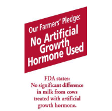

Biopolitical's [comments on labelling](https://jeremycherfas.net/blog/new-kid-takes-on-the-terminator/) prompted me to check again the whole story regarding Monsanto's product [Posilac](https://web.archive.org/web/20070416074609/http://www.monsantodairy.com:80/index.html), a synthetic version of the hormone called bovine somatotropin. BST is produced in the pituitary gland and influences the production of milk (among other things). Farmers can inject cows with recombinant BST (or rBST) once every couple of weeks and thereby boost milk production by between 10% and 40%. The use of rBST is [banned in the European Union](https://agbioforum.org/the-regulation-of-rbst-the-european-case/) but permitted in the United States (and elsewhere).

By many standards, rBST is pretty much safe. There have been no solid demonstrations of effects on human health, as far as I am aware. There is an impact on animal health; Monsanto’s labels warn that cows given rBST are more likely to develop mastitis. This is an inflammation of the mammary gland that affects nursing mothers too. In cows, it is often recognized by the presence of high levels of white blood cells in the milk. Opponents of rBST often describe this as “pus-laden milk”[^1] which may be a marketing triumph but is not exactly fact-laden. But I digress. Mastitis may require the use of additional antibiotics, and that certainly does impact on human (and animal) health. Environmentally, rBST seems to be neutral. In fact, one can make a case that it is good for the environment. Fewer cows to produce the same amount of milk means less methane to insulate the global greenhouse and lower impacts all the way down the food chain. Socially, rBST has a negative impact on smaller dairy farms, because big farms benefit more from their economies of scale.

[^1]: 2022-03-10: That particular [link](http://www.veganrepresent.com/forums/showthread.php?t=1990) has now vanished, but the claim lingers.

The US Food and Drug Administration pronounced rBST safe in 1985, and other organisations, such as the American Medical Association, followed suit. But consumers, pesky consumers, weren’t buying that. Nor were some smaller dairies and smaller dairy farms. So they wanted labels.

Monsanto sued.

{.left} The most celebrated case involved Oakhurst Dairy Inc, of Maine. Oakhurst's labels originally read “Our Farmers’ Pledge: No Artificial Growth Hormones”. After [settling the case](https://reclaimdemocracy.org/monsanto-v-oakhurst-dairy/) out of court Oakhurst agreed to add the word “used”. Oakhurst also had to agree to add the phrase “FDA states: No significant difference in milk from cows treated with artificial growth hormones.”

Monsanto’s argument has always been that dairies cannot describe their products as “rBST-free” because there is no difference between rBST and authentic BST and all milk contains traces of BST (pasteurization destroys 90% of the hormone). “Monsanto’s only request is that Oakhurst label their products fairly and accurately so that consumers can make an informed choice,” said the company’s [press release]~~http://www.monsantodairy.com/updates/OakhurstDairyInc.Filing.html~~, which also  states:

> Monsanto fully supports the right of people in grocery stores to make informed choices about what they purchase. We believe that consumers should be able to make these informed decisions based on fair and accurate factual information about the quality and safety of the products they purchase. Currently, the labels used by Oakhurst are contrary to the position of the Food & Drug Administration for the voluntary labeling of milk and milk products with respect to the non-use of rBST, and violate state laws regarding unfair and deceptive commercial practices. The current labeling practices of Oakhurst fail to fully disclose years of scientific evidence that milk from cows supplemented with rBST is the same as all other milk. Scientific studies conclude that the use of rBST to improve milk production does not change the nutrition, taste, quality, or any other health or safety characteristics of milk.[^2]

[^2]: 2022-03-10: That press release too has vanished. But some of the same words are [cited elsewhere](https://www.sourcewatch.org/index.php/Labeling_Issues,_Revolving_Doors,_rBGH,_Bribery_and_Monsanto) so I am prefectly cojntent to olet this stand.

And that, for me, is the problem in a nutshell. Monsanto stresses all that “scientific evidence” but consumers couldn’t give a fig for scientific evidence. They care about not drinking pus-laden milk, or supporting smaller farmers, or simply stiffing it to The Man.

I wonder how many Oakhurst customers even noticed the addition of the word “used” to the farmers’ pledge?

Increasingly these days consumers are out of touch with producers or, to put it more simply, eaters no longer speak to farmers. They need labels which, like brands, substitute for a relationship. When the nature of the relationship changes -- think of [Ben & Jerry's](https://www.benjerry.com/) and [Unilever](https://www.unilever.com/), or [Seeds of Change](https://www.seedsofchange.com/) and the [Mars Corporation](https://www.mars.com/) -- the labels often stay the same. I wonder why?

I **know** that Ben and Jerry would never have used milk from rBST treated cows, even though I have never had any information to that effect. But Unilever? Sure, if it made economic sense.

Which is why I like the idea of companies being able to tell me what is in their products. Labeling is a battle-ground in which the deep-pocketed bullies can make enforce their views and in which governments prove generally supine. If compulsory labeling is not the answer, and it seems that opposition by those with most to lose will see to it that it isn’t the answer, then perhaps we need to fight for the freedom to label.
