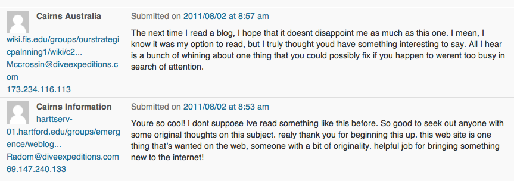

{.center}

Time was when a blogger in search of inspiration looked no further than the search terms people brought with them. [Me too](https://jeremycherfas.net/blog/we-all-get-email/). Today, though, I happened to delve into my muck filter and discovered the schizoid spammer pictured above. So am I appreciated, or despised? You be the judge.

===

In any case, inspiration is often more about a bit of time than a bolt from the blue. This morning, however, three bolts struck, and it wasn’t until 11 hours later that I’ve had time to unravel them.

Bolt No. 1 a Ted talk by [Kevin Slavin about How algorithms shape our world](http://www.ted.com/talks/kevin_slavin_how_algorithms_shape_our_world.html). I’m not sure I entirely got everything he was trying to say, but I certainly got the way he used some great footage of, I assume, starlings in megaflocks to illustrate his point. Or points.

Bolt No. 2 the immediately following Ted talk, by Markus Fischer, who demonstrated his [robot that flies like a bird](http://www.ted.com/talks/a_robot_that_flies_like_a_bird.html), a mechanogull that flaps its wings, steers, lands, and everything.

Bolt No. 3 [a comment from my friend Derek](https://web.archive.org/web/20120418062956/http://jeremycherfas.net/wp/Archive/2011/07/30/ceci-nest-pas-un-blog/) on my previous post,[^1] which augurs well for the impact of this post, not least because Derek is a big fan of starling flocks and portents for the gull-able. So I’m hoping he’ll be able enjoy those two Ted talks, and maybe we can consider some options. A huge flock of mechanogull birdbots, linked to one another only as a network and doing the starling fling. Or a single steerable mechanogull doing his bidding and so creating his own auguries. Like the white dove that shoots from Florence cathedral on Easter Sunday. When I saw this spectacle, I was told that in times past an actual dove was released, and that if it flew straight out of the cathedral doors, that presaged a good year. Nowadays the dove is fake, and on a wire that takes it straight out of the cathedral door, thus **guaranteeing** a good year. Of course, that’s not the story they tell in [this history of the bird on a wire](https://web.archive.org/web/20110810062952/https://www.duomofirenze.it/feste/pasqua_eng.htm), but I don’t care.

Bonus Bolt Ted gets the same stupid kinds of spam that the rest of us have to put up with, and even their awesome filters, which are surely more advanced than anything in the real world, fail to block some of it.

Which lends a certain roundness to this post.

[^1]: 2021-08-02: Alas, one of the things lost in moving this site from CMS to CMS is that sometimes the comments did not survive. Where possible, as in this case, I’ve been able to recover them from the Internet Archive, for which praise be.