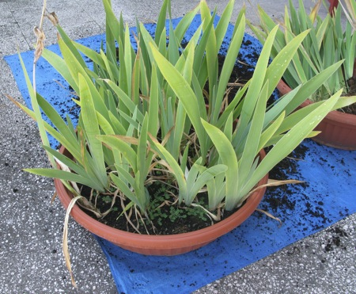
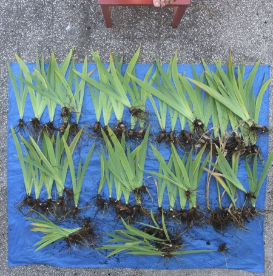
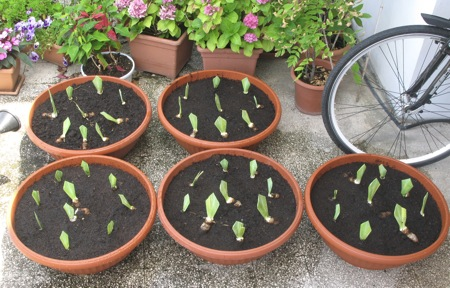
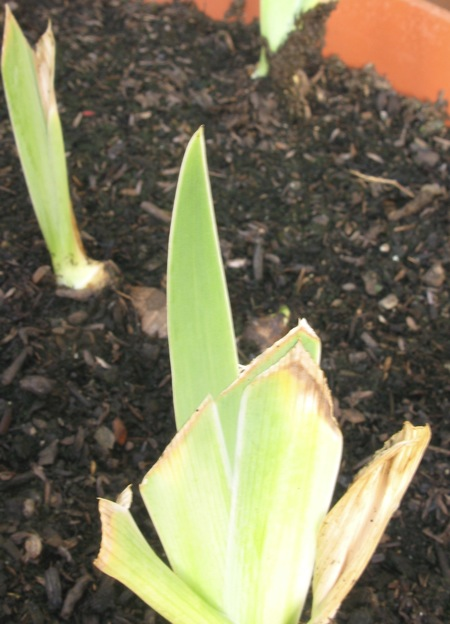

I was very remiss last summer and failed to decongest the irises. As a result this year's show was pretty poor; only four blooms. So a couple of weeks ago I bought three new tubs and some soil and set to. Step one, take two packed tubs ...

{.center}

And divide them up into replantable bits (toes optional).

{.center}

Trim to reduce windrock, and plant up in new soil.

{.center}

Then water well, and keep watered, and examine zealously every day, always fearful that you have left it too late, until one day you see that one plant (out of 45!) has produced a new leaf.

{.center}

Then sit back and wait 10 months.
