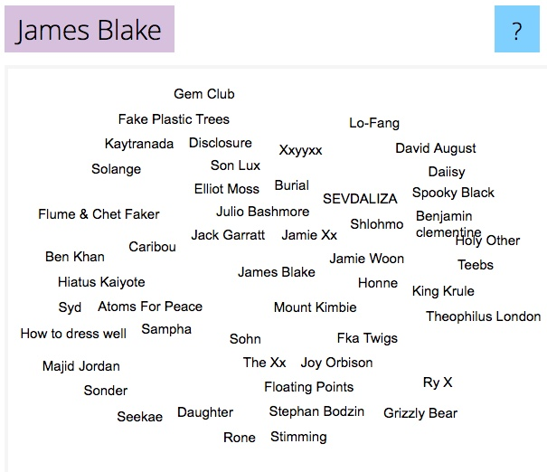

A funny collision of things happened yesterday morning. I had just listened to a Broken Record podcast in which [Rick Rubin chatted with Dave Cobb](https://brokenrecordpodcast.com/episode-83-dave-cobb/), and in the middle of the mutual love-fest, Rick said that the latest musician to have really excited him was James Blake. I’ve never heard of James Blake, so much so that I didn’t even start listening to the Broken Record episode two before, in which Rick and James chatted. That’s me, ignorant **and** opinionated. But willing to explore.

Not an hour later, someone — and I really have no recollection who, so if it was you, raise your hand so I can give credit — posted a link to [Music Map](https://www.music-map.com/) with a promise, as I recall, that it would free your music discoveries from Spotify’s magic clutches. Off I hastened, checking how good it might be by bunging in a few of my favourites and then agreeing, mostly, with the way it mapped other artists around them. On a whim, I plugged in the name James Blake, and the most surprising thing about the result was that there was not one single name in his orbit that I was familiar with. Not one.

{.center}

I’m currently listening to Blake’s *The Colour in Anything*, the album Rick Rubin worked on. It’s very pleasant, melodious and minimal, and I can’t understand the lyrics at all, which is a blessing because I can’t work while listening to lyrics I can understand. Maybe I’ll add it to my music to work to playlist. Can’t be certain yet. I do suspect that I would never have just listened had I not first seen exactly how lost I was by looking Blake up in Music Map.

Music Map’s parent, as it were, is the Global Network of Discovery, which looks like a bunch of fun. And I think it may already have recommended the next novel I will read.
