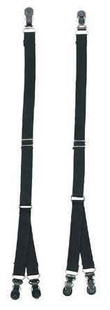

You know how it is when you’re idly procrastinating. You click here, you click there, you click way over on the other side -- and before you know it you’ve landed in a place too boggling to imagine. That’s how it was when I flashed from a del.icio.us popular link to investigate [Jack Bauer’s gear](https://web.archive.org/web/20070208215334/http://www.uncrate.com/men/gear/misc-gadgets/jack-bauer-gear-008978.php). Most of it, I confess, I have no real need for. (Yeah, yeah, I know this is not about needs.) But a person is always in the market for the ultimate piece of luggage, so the [messenger bag] ~~http://www.amazon.com/exec/obidos/ASIN/B000IS2BGK/ref=nosim/uncrate-20~~ had a certain appeal. One thing, though, if you’re going to wear a Jack Sack instead of a Murse, you need to be ultra-cautious. So you head over to the storefront of the people who claim to be selling what they claim is the genuine article, and you find ... [Black Y Style Military Uniform Shirt Stays](https://www.amazon.com/Black-Style-Military-Uniform-Shirt/dp/B000E96BFK/sr=1-6/qid=1171308378/ref=sr_1_6/102-6547861-1337759?ie=UTF8&m=A297CMH5CE4RPW&s=generic).

{.left} Now you’re totally lost. These are not collar stays, no sirree. So what are they? You cannot figure it out. Your world spins. You’re blacking out. That insistent countdown is beeping again. Off you go on a wild spree of Googling. Clues come and go. finally you discover another, similar product: [Black Military Straight Shirt Stays](https://www.amazon.com/Military-Uniform-Straight-Black-Shirt/dp/B0001XLP9Q/ref=pd_sim_a_1/102-6547861-1337759?ie=UTF8&m=A297CMH5CE4RPW). And this has, if not quite instructions, at least a suggestion of why and how they might be used: _Keep your shirt tucked in for a comfortably sharp, crisp look and feel all day (or night) with these straight uniform shirt stays. Wear for business wear, formal occasions, presentation ceremonies. Adjustable to approximately 28" long with a metal clip on each end. 4 per pack. Clips do not puncture apparel._ 

But it isn’t the whole story. Can’t be. Which bit do you clip to where? You go back to the original Y Style Stays, and re-read. Wait a minute. That wasn’t there before. Or was it? Right there under the product description. _Single Clip Attaches To Sock. Double Clip Attaches To Shirt Tail._ So now you have a picture. A super neat military type (emphatically not disheveled Bauer) stands, trouserless, before a mirror. He clips the shirt stays to his socks, front and back, stretches them gently, clips them to his shirt tails, front and back. Now he slides his trousers on, and admires the taut fabric of his shirt vanishing smoothly into his waistband.

Sharp!

I’m thinking, this guy would definitely use the Straight Shirt Stays. He’d appreciate, too, the extra snap that 28-inch elastic gives to even the simplest move, like a knee bend. And the gentle workout to his quads and hamstrings has to be a good thing too. Like I said, sharp.

But then, the day being early and the procrastination well advanced, how come this sharp guy, with his neat-o wrinkle-free satin twill dress shirt, how come he also viewed [this item](https://www.amazon.com/Underwear-Bikini-T-Back-G-String-Purple/dp/B07MZDF8J8/ref=sr_1_3?crid=1O1KCV35IYE8Q&keywords=micro+G+string+for+men&qid=1644654952&sprefix=micro+g+string+for+men%2Caps%2C186&sr=8-3)?
