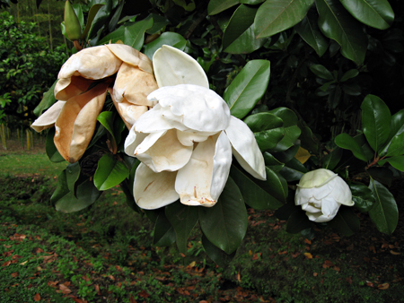

{.center}

Where does the time go? A rhetorical question, of course, designed to deflect attention from the fact that I seem to have been waiting weeks to upload some photos from a recent (ha?) return visit to the gardens at Ninfa. I’m uploading four at a time, partly to lessen the load and thus make it more likely that I will actually do the job, and also so that they show up in my little sidebar to best effect. Maybe later I’ll create a new set.
