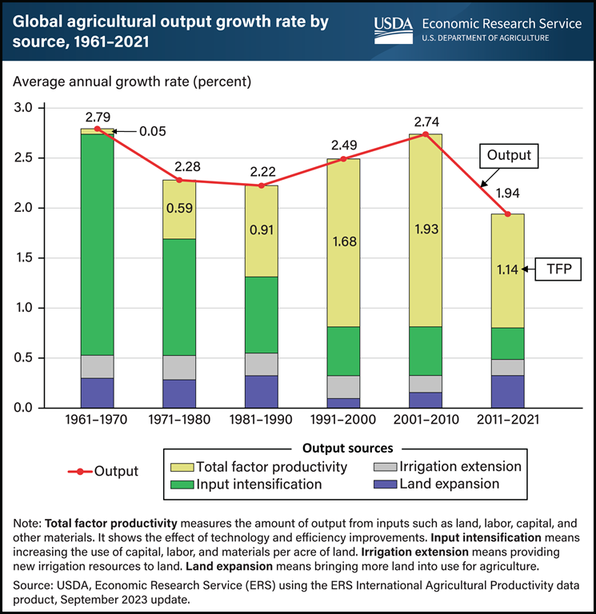

Bad news, Optimists. Latest data from USDA Agricultural Research Service shows [a steep drop in agricultural output growth](https://www.ers.usda.gov/data-products/chart-gallery/gallery/chart-detail/?chartId=107931) in 2011–2021. That despite an increase in land converted to agriculture.

{.center}

Hard times are coming, we just can’t be sure about when.
