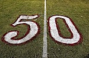

_This post is number 50 in [a series](https://jeremycherfas.net/blog/tag:50%20x%20100%20x%2050)._

{.left} Hard to believe. I could never have planned it this way. Later today we start a long weekend of serious R&R, but today I post my last post in this series (except that I may well continue; it’s fun). After all the blood, the sweat, the toil, the tears, to end on this joyous day of global celebration for the scab-covered, armpit-stained, world-weary, red-eyed working stiffs of the world! As a card-carrying inky wretch I am proud to stand [shoulder](https://bluegirlredstate.typepad.com/blue_girl/5010050_challenge/index.html) to [shoulder](http://wren-o-blue.blogspot.com/search/label/100%20words) with other bloggers and our [inspiration](http://oocradio.blogspot.com/) and say to the world: “Woo-hoo”.  

Flickr photo by [m.a.x.](https://flickr.com/photos/maxshirley/)
