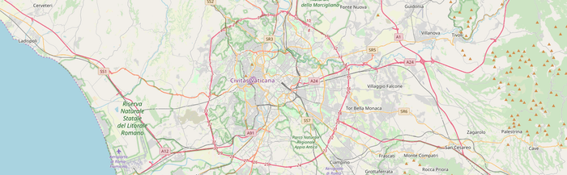

 

After a lot of trial and error, I think I have a system for creating and using routes that I can live with.

===

With a long walk coming up in a few months, I’ve been trying to do some longer walks here, but I am also bored rigid with everything local. I’ve got plenty of books of walks, but to be honest most of them I find just not very good, and rights of way and signposting is not quite the same in Italy as it is elsewhere. So I decided to try my hand at using the guidebook and a digital map to create a route that I can download to my phone and then use navigation to keep me on the straight and narrow.

And I want to do that while staying signed out of Google, not because I’m paranoid but just because I don’t see why I should work for them for nothing.

It ought to be easy. Draw a route on a map, download a file with the details of the route, upload the file to the phone and open it in my chosen app, [OsmAnd](https://osmand.net/). My first thought was to sign in to Google and draw the route that way. First I allowed Google to draw it’s version of a suitable route from A to B. Then I started dragging parts of the route around so that it went through some parks and along smaller streets, but it proved beyond me to produce exactly the route I wanted. Points kept jumping here there and everywhere. I did finally produce something I was at least not unhappy with, and given that this trial run was a very urban walk, I knew I could also do some navigating on the ground.

Google offers a download of the route as a GPS file. OsmAnd wants a GPX file. A bit of searching on the OpenStreetMap wiki took me to [GPS Visualizer](https://www.gpsvisualizer.com/gpsbabel/), an online interface to GPSBabel. You upload a file, it transforms it into another format. That gave me the GPX file I needed. Saved to DropBox, downloaded onto the phone, opened in OsmAnd, done deal. [^1]

[^1]: Or it would have been, if I had known in advance that the train station where I planned to start was a request stop. I mean, whoever heard of a request stop on a train? No matter, we crossed over to the other platform, and when a train came round the corner stuck our arms out. It stopped. Anyway …

## There is a better way

With all that rigmarole in mind, I plucked up the courage to go to an OpenStreetMap meet-up on Monday night, to practice my Italian and to share my problems. It was worth it, on both counts. For one thing, I learned some of the words around what I wanted to do, and was pointed to the [Track drawing websites](https://wiki.openstreetmap.org/wiki/Track_drawing_websites) of the OpenStreetMap wiki. People also recommended gpsies (a cute name, no doubt), even though it had been bought out by [AllTrails](https://www.alltrails.com/).

Yesterday morning, I started to explore AllTrails. The first thing to note is that although there is a free tier, this is a paid app. Creating a route is not that difficult, and it is easy to download. The site also contains thousands of maps and GPS traces that other people have recorded and shared, and the presentation of those is really slick. Still, the annual subscription is $30, and while I could get by on the free plan, and there’s no denying that the website (I haven’t tried the app) is very smooth indeed, that would be yet another cup of coffee a month that I would have to forego.

## The best way

So I started working my way through some of the other apps that the Wiki lists, and the hands down winner was this [distance calculator](https://map.meurisse.org/). It doesn’t have a search facility (that I could see) so you’ll have to find your own way to your starting point, but from then on, a series of mouse clicks draws a route. Nothing else I tried was that simple. Each section of the route has a mid-point that you can drag into position, which makes fine-tuning the route extremely easy. And when you are satisfied with the route you have drawn, you can download as CSV, GPX or KML. No saving. No logging in. No translating one format into another.

I’m sold. Now, where do I pay? Seriously, if anyone knows who is behind that site, I’d like to give them a little something.
