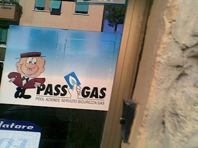

{.center}

It would be easy enough to post every time one went to an exhibit here, about the disrepect given the English language in Italy. Sponsors pay large amounts to support beautifully staged art exhibits, and then allow the boss’s 14-year old to do the signage because they’ve had a couple of years of English at school. Easy, but futile. Instead, I’ll let one picture speak for all.
