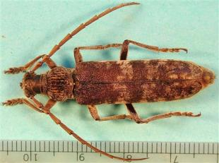

{.left} Today’s guest, left, is _Rhytidodera bowringii_, a beetle that has “decimated mango plantations”. A single live specimen was detained on its way in to Miami. [The news](https://www.iatp.org/news/mango-eating-asian-beetle-found-in-florida) was released on 10 March.

Two days later, the New York Times publishes a [swingeing attack](https://jeremycherfas.net/blog/its-an-ill-wind/) on Florida mangoes.
 
Coincidence? I think not. I look forward to a ransom note from Madhur Jaffrey.
