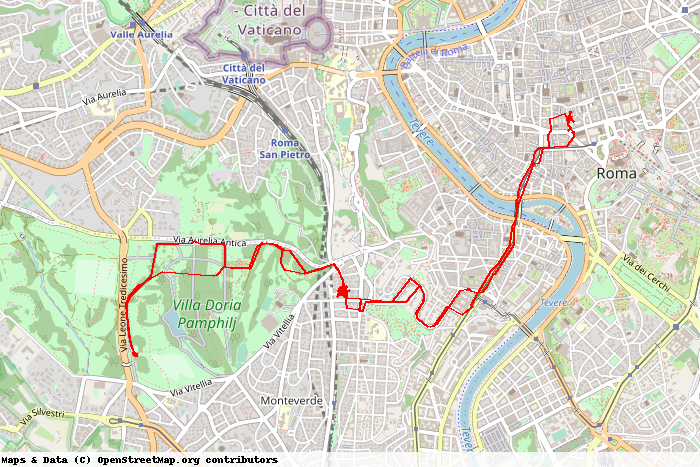

Jubilation! I now have a Python program that accepts a date in the form `YYY-MM-DD`, gets all the [Overland](https://github.com/aaronpk/Overland-iOS) data for that day from [Compass](https://github.com/aaronpk/Compass), and builds a static map of my wanderings for that day. And it works. Here is today, so far.

===

[

There was no single breakthrough is all this, rather a series of butting down obstacles with my head. I spent too long chasing online services that offered a static map option but that were designed to provide a snatch of code that would render the static map when run. I maybe _could_ make something to ask for the map and then save it, but not without learning a whole lot more.

I gave up on that and looked around for something that would do the job directly, eventually landing on [py-staticmaps: A python module to create static map images with markers, geodesic lines, etc.](https://github.com/flopp/py-staticmaps). I had looked at it right at the start of this odyssey, but gave up because it did not appear to use geoJSON. Then I retraced my steps and decided to see whether I could make it work by converting my geoJSON into GPX, a form it is happy with.

After another frustrating day attempting the conversion, I came across this note, buried in GPSBabel:

> In reality, for all but the most simple uses, … you should not expect high fidelity transfers through this format.  
> The potentially nested/recursive nature of GeoJSON in general would be an awkward implementation. 

The working examples for staticmaps convinced me that I ought to be able to convert the data myself, and so it proved, but not without another frustrating day — or was it two? — mangling strings into floats which then magically turned back into strings and altogether brought me to the brink of tears.

Finally throwing myself on the mercy of online friends, I was told to use `json.loads`. I read up a bit more, and that proved to be the magic I needed to create a list of latlng points in a form that Staticmaps would swallow. 

I am now pretty happy. And yet, I feel the need to complain about the miserable state of online Python “tutorials”. There is so much sketchiness out there, not to mention blatant plagiarism, and even the better stuff doesn’t really explain anything, it just says “do it this way and she’ll be right”. When I do it that way and it isn’t right, my frustration grows and I yearn to understand, but find precious little understanding out there.

The thing is, I do understand the basics of computer programming at a faily high level. I learned Fortran, did my share of BASIC, got things working in Assembler, mangled PHP and lately started to explore Python. Along the way, however, and in parallel with my decreasing understanding of what was actually going on, I lost track of how to do things properly, constrained by what I thought I already “knew”.

A simple example. In the course of building my list of latlng points, I needed to add each point to the existing list. Fine, I know how to append to a list. `pointslist = pointslist.append(point)`. 

Wrong!

The right way, as online chums pointed out as soon as I had torn more hair out trying to discover the error of my ways, unhelped by anything online, is the naked `pointslist.append(point)`. All that supposed amateur programming experience still insists that if you are going to change the value of something, then you need to assign something new to the something. 

OK, that’s a trivial point, and says more about my inexperience than anything else, but I have found it difficult to gain a real understanding. The chums recommended a new book, [Dive into Python3, by Mark Pilgrim](https://histo.ucsf.edu/BMS270/diveintopython3-r802.pdf). I’m only one chapter in, and already I feel I have a somewhat better grasp of some things. We shall see.

As for the static map, I have lots of ideas I want to add. Different colours for different modes of movement. Multi-day tracks and, conversely, just part of a day. Markers, possibly linked to images or notes. All of which will, if I let them, deepen my understanding. I hope.
