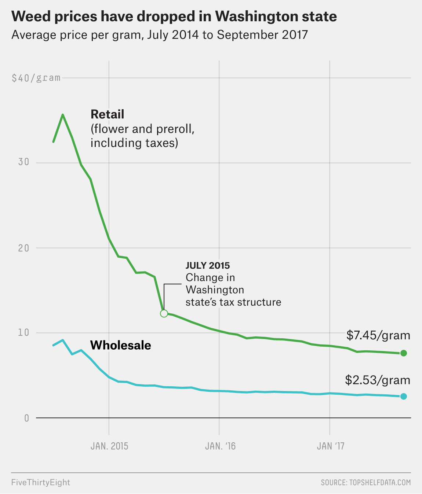

Legalized marijuana is going the way of all agricultural commodities in the United States, and that shouldn't be a surprise. A really interesting analysis by [538](https://fivethirtyeight.com/features/legal-weed-isnt-the-boon-small-businesses-thought-it-would-be/) reveals that the price of pot has dropped for grower and dope fiend alike, and with big money at stake -- $6.7 billion this past year and $20 billion the dream for 2021 -- big money is very interested. The market, according to 538:

> increasingly favors big businesses with deep pockets. As legal weed keeps expanding, pot prices are likely to continue to decline, making the odds of running a profitable small pot farm even longer. 

===

{.center} 

There's a lot more detail in 538's piece, all of which I found fascinating. In so many respects, marijuana is a mirror of food. Capital makes it possible to produce the stuff for less (not counting externalities), so that even within limits on the size of pot farms, bigger operations dominate.

> From January through September of this year [i.e. 2017], the 10 largest farms in Washington [state] harvested 16.79 percent of all the dry weight weed grown in the state, which is more than the share produced by the 500 smallest farms combined (13.12 percent).

Then there's the diversification of the product itself. Not so long ago there was basically dried marijuana flowers, which when Washington state legalized the market in mid-2014 made up almost 95% of sales. Now buyers face a paralysing choice of different products, from the stuff you put in e-cigarettes to a wide range of sweets and snacks -- with bud currently less than 55% of the market. 

The manufacturers of marijuana goodies need expensive equipment to extract the good stuff and then make things from it, adding to the expense of the operation. It's an inevitable echo of overstuffed supermarket aisles that feature more food-like products than you can possibly imagine utterly dominating a small area dedicated to ingredients from which one can make food. 

Pot manufacturers are both adding value and trying to create products that can be distinguished from one another and thus, perhaps, command a price premium. There's concentration in this sector too. More than 1000 companies are licensed to produce cannabis edibles, but the top five accounted for just over half of the Washington state market and the top 20 for more than 90%.

All this could easily have been foreseen, and was, by people who have studied the development of the food industry. One concomitant that they have not noted, yet, is the loss of biodiversity. Underground plant breeding, sometimes literally, fuelled the modern marijuana industry with a rainbow cornucopia of exotically named varieties, each touting specific traits of interest to consumers in addition to the enhanced productivity that growers want. And as long as the market was supplied by small growers, that diversity was readily available and often regionally distinct. With the concentration now happening in the industry, how long before there are only a handful of different strains, offering just a few different highs?

And once that has happened, how long before the small growers show up at farmers markets, touting their heritage, organic, sustainable varieties of pot? Except, of course, that most modern pot varieties are F1 hybrids designed to produce only female plants, often grown hydroponically. Is that acceptable?

Happy New Year