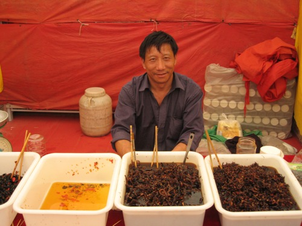

{.center}

Markets **are** fascinating. Wherever I go in the world, I consider it a real treat to be able to wander very slowly through the markets, seeing what there is, seeing whether I can identify things I've only read about, just soaking it up. Kunming is no exception and I spent a very happy hour this afternoon wandering through a pretty large market that featured clothes and hucksters with labour-saving devices in addition to foods and ingredients to blow the mind. The light wasn't great for photographs, and some people preferred me not to steal their souls, though I did manage [some](https://flickr.com/search/?user_id=73529121%40N00&sort=date-taken-desc&text=kunming&view_all=1).

But this particular man set me thinking. Almost every stall — well, that's an exaggeration, but an awful lot of them — had bowls of this stuff, whatever it is. Heavy on chillies, obviously. But most of the others had many, many other things besides, and not just chilli-based things either. I don't know why he didn't, and he wasn't besieged by customers, so it isn't as if he has decided to focus on just one thing and is now the best in Kunming. But truth be told, for all the unidentifiable diversity present on the stalls, the fishy things, the fleshy things, the fungal things, the flowery things, the things whose kingdom cannot be fathomed, they soon become boring in their diversity.

All maddeningly diverse, and all alike in their diversity. Makes sense to me.

And the same is true at markets where everything is identifiable and familiar. My local street market in Rome has several stalls with hugely overlapping selections of species and of varieties. I buy from the people I like or, sometimes, from someone else if their produce looks and tastes particularly good that day. I expect the Chinese do exactly the same. And maybe a visitor from China would find my local market all rather samey after a while, and wonder why I chose one over another.

One thing I had never seen before, and that I failed to photograph, was on the spot _tahini_, or whatever they call it here. Two stone mill wheels, a bowl of sesame seeds on top, and the top stone rotated by a small electric motor. Out of the space between the stones oozes fresh sesame paste to die for. Actually there was lots more I had never seen before, but I swear that I was the only westerner there, and nobody spoke more than two words of English, a match for my Chinese.

Cross-posted from [agro.biodiver.se](https://agro.biodiver.se/2007/09/market-diversity/).
