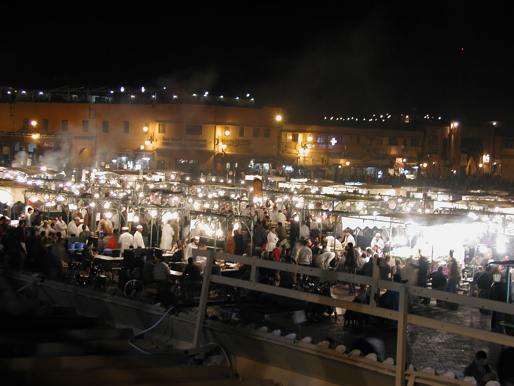

_Enfin_, an evening that did not involve the complex dynamic of more than one person. Almost. Shared a ride down to the Jamaa el-Fna with a colleague at the training course, and we wandered contentedly through a minor part of the souks, away from the main square, seeking last minute presents. We supported each other’s bargaining, happy to walk away from places in time honoured tradition. We did both buy things, and both felt that, despite hard bargaining, we had still been had. Still, being had is part of the experience. And given that the first asking price is itself remarkably cheap, I feel a bit of a bastard for not just handing over the cash no questions asked. But of course, that would be an insult, I think. A welcome insult, possibly, but an insult nonetheless.

Then off he went, to meet some friends, and I was at last alone in the square, free to stop when and where and for as long as I wanted. First off, a mint tea on the third floor terrace of a residence hotel, with a perfect view of the Koutoubia mosque and the square. I can quite see how spectacular it must be at sunset, as a friend had earlier insisted. But alas I have been in an underground bunker these past three days with barely a glimpse of the sun. Then down into the square to marvel at the night-black men selling strange substances from the desert. Tortoises (alas) and ostrich eggs, and feathers, and dried lizards of some sort, and myriad other natural and not so natural products, all vaguely medicinal. Most galling, the men wore the most beautiful indigo blue head cloths, which naturally are nowhere to be seen in the souks. Only gaudy synthetic colours. I’d willingly pay top dollar for a piece of simple, indigo cotton. But there was none. And I didn’t have the gall to ask one for the turban off his head.

{.center} 

Then the food, sat at a bench in the square, at a stall selected purely on a whim, munching lentils and aubergines and peppers and bread and meat kebabs, washed down with sweet mint tea. It was spectacularly good. One to share with would have been nice, a special one, and will be one day, but being alone was almost as good. In the square, the storytellers, holding a crowd silent -- save for gasps and laughs -- as they have done for centuries. And musicians. So many musicians. A bloke with a heavily electrified oud, two drummers and a tambourine, playing a wonderfully hybrid style that owed as much to my tradition as his own. A neat touch: the tambourine player used his instrument to solicit coins and it was way too dark outside the circle to see the contributions, so when he’d worked the crowd he dumped the tambourine’s contents into the centre. A handful of mostly small coins. The musicians all stopped playing at once, disgusted with us.

In another circle, the lead instrument was a five string banjo, which I thought was pretty odd until I realized that there was fundamentally not much difference between it and the skin covered tortoise shell resonator of the instrument favoured by the Gnawa musicians. For about an hour I wandered happily from circle to circle, staying longer at some than others, jealous sometimes that I couldn’t understand what was going on, sad that this was my final evening.

And then it struck me. All that Crosby Stills nonsense about the Marrakech Express; why didn’t it sound in the least bit Moroccan? Did we think it was groovy? Even though it wasn’t in the slightest “foreign”. Or were we just too stoned to care. Speaking of which, not once -- not **once** -- was I offered even a smidgen of finest Moroccan black. I must look old.
