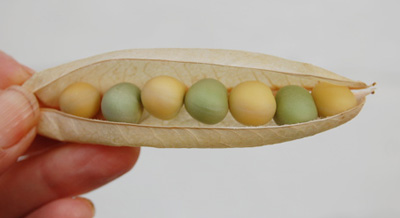

{.left} Happy [Befana](https://en.wikipedia.org/wiki/La_Befana) from a freezing Rome. Got myself in a bit of a tizz with all this Blog Carnivalia stuff. I thought I was hosting Mendel’s Garden over at the [Agricultural Biodiversity Weblog](https://agro.biodiver.se/), but it seems I agreed to do it here instead. Not sure why, especially after my recent idleness. P’raps I’ll cross-post. Anyway, on with the show.

[Quintessence of Dust](https://sfmatheson.blogspot.com/2009/01/clone-wars-or-how-evolution-got-speed.html) examines one of the challenges to evolutionary theory, that large populations will adapt more rapidly because they contain a greater range of beneficial mutations lying in wait, as it were, for conditions to change. Only, it ain’t so. Steve Matheson explains new investigations of clonal interference and the difference it makes to estimates of mutation rates and speed of adaptation. Also, it touches on sex.

There's a new kid on the block too. Ian Dworkin has just launched [Genes Gone Wild](http://genesgonewild.blogspot.com/2009/01/), which he says will distinguish between "Gene X for Disease Y" -- as seen on the news -- and "a variant of gene X influences disease Y". Yes, Ian says, "things are sadly more complicated than we might like". Good luck with your mission Ian.

As I contemplate a “procedure" (ghastly euphemism) myself, I'm attracted to Sandra's post [Personalized Medicine is on the way (but not quick enough)] ~~http://scienceblogs.com/digitalbio/2009/01/personalized_medicine_is_on_th_1.php~~ over at Discovering Biology in a Digital World. Genetic screening can offer all sorts of useful and valuable information, but only if the patient and the doctor know how to make use of the results. Sandra’s point is that things are moving so quickly that we’re all in danger of being left behind -- and if you want a reason to catch up, perhaps a [lawsuit](http://thegenesherpa.blogspot.com/2009/01/it-coming-fda-considering-changing_6866.html) would focus your attention.

A little technical argie-bargie is getting aired over at Evolgen, where RPM asks, only somewhat rhetorically, [Do people still use microarrays?](https://web.archive.org/web/20120521163516/http://scienceblogs.com/evolgen/2008/12/do_people_still_use_microarray.php) They do, but there are other techniques they could be using, and perhaps getting better answers. Having laboured mightily, long ago, to understand both Sanger and Maxam-Gilbert, and more recently to get to grips with [Solexa](http://archive.sciencewatch.com/ana/hot/bio/08sepoct-bio/), I'll just say, There'll always be a better tool just around the corner.

And now, if I may be permitted, allow me to introduce all you super-duper, shining, modern, sequence-reading geneticists to a woman who is, I swear, the living incarnation of Mendel’s Garden. Rebsie Fairholm is following in The Monk’s footsteps with a pea breeding project that is, to me at any rate, the most fascinating thing on the web at the moment. Her latest post on the subject is [Welcome home, little peas](http://daughterofthesoil.blogspot.com/2008/12/welcome-home-little-peas.html), but every single one of the posts in her pea-breeding project is worth reading.

{.center}

Rebsie’s explanations and photographs will bring Mendel’s Garden to life for you, your loved ones, your students, and indeed the entire curious world. Speaking of which, I don't seem to recall Larry Moran's post [Identity of the Product of Mendel's Green Cotyledon Gene (Update](https://sandwalk.blogspot.com/2008/11/identity-of-product-of-mendels-green.html)) getting any exposure, so I will further abuse my privileged position by linking to it now.

And if you've made it this far, you'll be waiting for me to blow my own trumpet. So here goes: [The hype goes on](https://agro.biodiver.se/2008/12/the-hype-goes-on/), and [El Hombre de la papa](https://agro.biodiver.se/2008/12/el-hombre-de-la-papa/), a video of [Carlos Ochoa, who died last month](https://agro.biodiver.se/2008/12/carlos-ochoa/). Two very different takes on the application of Mendelian genetics to feeding people.

No next host for Mendel's Garden is mentioned up [on the list]; you could volunteer, and of course you can also submit posts there. I’m sure the proprietor is in less of a tizz than I am.
