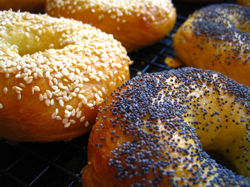

{.center}  
> The latest look into the impact of New York's water supply on its bagels yields a new potential factor: pride...

The business about the chemistry of water being a vital part of some product is always intriguing. Anyone for a Burton? But [this piece](https://www.smithsonianmag.com/arts-culture/confidence-in-water-leads-to-confidence-in-bagels-21212304/?+Think+%7C+Smithsonian.com=) seems to suggest that there may be more to it than that. Or rather, that sometimes the water is less important than people think.