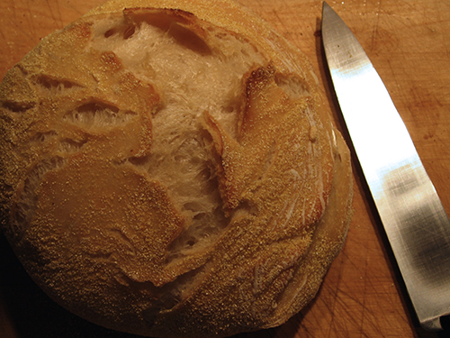
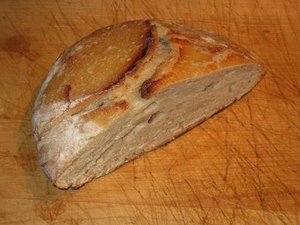
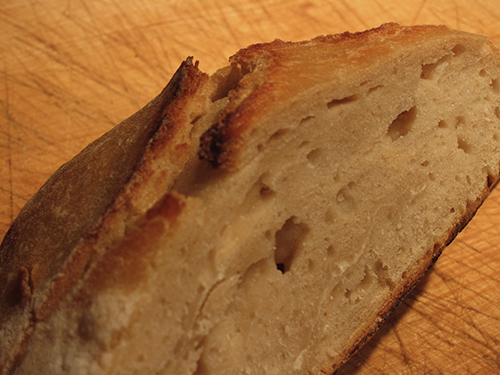

I know that everyone and her cat has already [blogged](http://100loaves.blogspot.com/) Jim Lahey’s No-knead bread, as seen last week in the _New York Times_. That won't stop me adding my take on the matter, late through no great fault of my own. That is, I’ve been snowed under at work, one reason why posting here has been slight of late, and when not at work I’ve been socializing conscientiously, leaving no time for solitary pleasures. Indeed, one reason I opted to try that bread is that I haven’t had time to make bread the traditional way for ages. So, last Thursday I threw the ingredients together, and on Friday I baked the loaf. I was working while it was in the oven, but in a manner of speaking live blogged the entire event in a series of one-line emails to a friend who shares my passion for good bread. Not that I’m going to resurrect those here.

{.center}

The point is, it worked. and it worked amazingly well. The dough was incredibly loose, more like a _biga_ or _poolish_ than like a proper bread dough. And it slopped all over the shop. Instructions to form it into a ball I regarded as a joke. No sooner had I done so than it collapsed into a pancake. But I managed to get it into the heated casserole without incident, and then monitored its progress, and I was astounded. It sprang up beautifully. The crust hardened, but the crumb kept rising, until it broke through, resulting in those luscious crispy points. The crust was crunchy and chewy (the cornmeal doesn't hurt on that score) and the crumb was light without being airy.

All in all, a miracle. And -- like all miracles -- a bit confounding.

I’ve learned a couple of things in a long history of baking. One, originally from Elizabeth David’s incomparable _English Bread and Yeast Cookery_, is that less yeast and more time invariably results in a tastier loaf. It’s obvious really that the longer the yeast has to work its biochemical magic, within reason, the more complex are going to be the results, and thus the better the flavour.  The other, from experience and all the books, is that there’s no substitute for a good knead. Doesn’t matter whether you do it by hand or by machine, there’s something that happens to the dough that makes it elastic, maybe even shiny, and an entirely different beast.[^1]

[^1]: 2021-09-08: Needless to say, I no longer believe this to nearly the same extent.

Lahey’s method reinforces the benefits of a long, slow rise. But the fact that it rose so well and had such a fine crumb with literally no kneading knocked me sideways. Mark Bittman, for his article on Lahey, was similarly flummoxed and consulted the God of kitchen scientists, Harold McGee (who started ~~[blogging](http://curiouscook.blogspot.com/)~~ a few months ago).[^2]: His response:

[^2]: 2021-09-08: And then stopped, pretty quickly, though of course he is [still online](https://www.curiouscook.com/site/about-harold-mcgee.html/).

> It makes sense. The long, slow rise does over hours what intensive kneading does in minutes: it brings the gluten molecules into side-by-side alignment to maximize their opportunity to bind to each other and produce a strong, elastic network. The wetness of the dough is an important piece of this because the gluten molecules are more mobile in a high proportion of water, and so can move into alignment easier and faster than if the dough were stiff.

Indeed, it does make sense.

{.center}

Buoyed by the first loaf, I decided to try a second one with my sourdough, which has made my bread for more than a decade, on and off. Mostly off, lately. I just used Lahey’s standard quantities, but instead of a smidgen of yeast, dumped in the ragged old starter. If anything this mix was even wetter than the first. But the result was just as good. Better, in fact, if you really like sourdough flavour, and I do.

{.center}

It didn’t rise as well, not surprising seeing as I hadn’t fed the starter in a couple of months. But the crumb was great, with the big holes that I personally really enjoy. and the crust was good and chewy. Next time, which may well be on Saturday, I’m sure it will be much better.

A few points in conclusion.

I’d like to have taken a photograph of the inside of the first, yeasty loaf. Unfortunately, it disappeared too quickly. By the time I realized that I had wolfed down the last _bruschetta_ with fresh, fruity olive oil, it was too late.

Rebecca has [links](http://www.rebeccablood.net/archive/2006/11/noknead_bread.html) to the article and the recipe.

I continue to loathe and despise the American habit of measuring solids (and powders like flour are solids too) by volume. I know I read an article once by Raymond Sokolov on why they do this, but I’m blowed if I can find it now. Nor can I remember his answer. Anyway, it is dumb. For anyone who is interested, I used 480 gm of 00 soft flour. And if you know the article I’m talking about, tell me where I can find it.[^3]

[^3]: 2021-09-08: Found, eventually, and still treasured.

All hail Jim Lahey.
