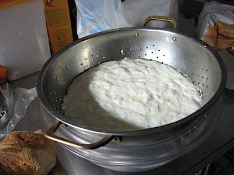

{.center}

Did the cheese thing again yesterday, but unscientifically changed two variables. I was much more gentle with the curds, ladling them out quietly into a colander and letting them drain under their own steam. That seemed to be a good thing, leaving soft and quivering curds that formed a single mass. But then I divided that mass into four to heat the curds in the hot whey prior to stretching and forming the balls. That did not seem to be quite such a good idea. I just couldn’t seem to get the right texture, although the finished cheese was rather delicious.

Next time, I think I’ll heat the whole mass of curds and try stretching and kneading that before splitting it into individual balls.
