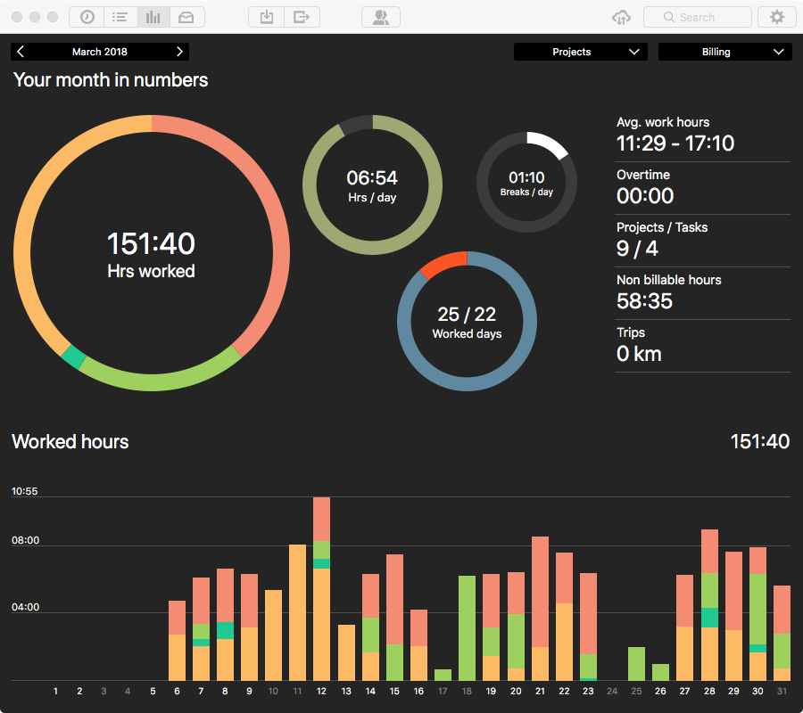
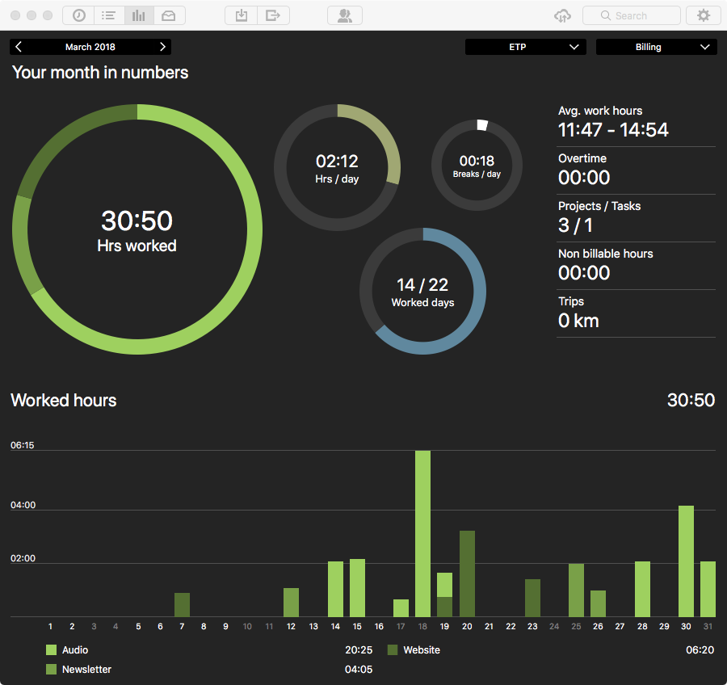

Two biggish changes this month. I switched my time recording software to [Tyme](https://www.tyme-app.com) and I am really liking it. I also downloaded [The Archive](https://zettelkasten.de/the-archive/) and am trying both to make it my preferred note-taking app (not so easy) and to adopt a stricter approach to notes based on [Zettelkasten methods](https://zettelkasten.de) (easier, especially with The Archive). Also started taking a proper PHP course in Coursera.

===

##Exist.io

No stunning new insights. Maybe I'm not recording enough stuff?

##Work

I have been a little bit busier, and at the end of the month received some things that will probably see me even busier in April. That's mostly good.

###Pomodori

I'm giving up on reporting pomodori here; serves no useful purpose. The main use I put them to is to force myself to look up from the screen, though not very often, and to force myself to keep working on one thing and not distract myself, very often. But here's the thing; my estimates of how long a task will take are generally fairly accurate, and I don't go back and ask why they are over or under with a view to adjusting future estimates. So what's the point?

###Tyme 40% admin, 20% ETP, 40% everything else

I really like Tyme, for all sorts of reasons. Toggl became laggy as hell with the new iOS app, and using it in a browser was just cumbersome. Tyme has a really super presence in the menu bar and it just works. I love the fact that I can easily adjust a start time and a stop time back by a few minutes. I really like that it stops itself after a period of inactivity, like if I walk away from my desk and get busy doing something else. Then, when I return to my desk, it offers me sensible options for what to do. The notes you can add to a task are a handy record, especially to note where you were up to and what to do next. There's good Alfred integration, when I need it. And the data presentation pleases me.

{.center} 

I feel pretty sure that the decrease in admin and increase in podcast are down to the greater ease of recording accurately in Tyme. There are some oddities, like I don't actually want to say that I work 7 days a week, though I often track some time every day, so the averages don't mean that much. I can, though, see where the time goes quite easily.

{.center} 

This is just the time spent on the podcast. I confess I am slightly surprised it averages more than 2 hours a day, overall. I would have guessed somewhat less. And as I digest that, my feeling is that it should actually go up, not down, to make the time spent worthwhile.

A tiny niggle is that I forget the hierarchy of Projects, Tasks and Categories, but that's minor as I don't often have to change them. The one thing I really feel cross about is that the iOS app costs extra. I get that there are additional costs, but I do feel that €24.99 for the OSX app might maybe come with some kind of discount -- free would be good -- for the iOS app. The reverse wouldn't matter as much to me.

###Goals

Managed 8 new posts and 15 old ones this month. That's better than expected for new posts and a bit worse for old ones, but still OK. Bringing in the old posts continues to be an interesting exercise, sometimes for how little has changed, sometimes for how much. And I have become much better at streamlining the process. A little more automation would go a long way. Even silly things like "use the clipboard to make a new folder here and change its name thusly" would be very helpful.

The old posts (just to give them a bit of a boost)

* [Little Ethics Street](https://jeremycherfas.net/blog/little-ethics-street) 
* [My head on a plate](https://jeremycherfas.net/blog/my-head-on-a-plate) 
* [New horizons](https://jeremycherfas.net/blog/new-horizons) 
* [Sheepish?](https://jeremycherfas.net/blog/sheepish) 
* [Snap](https://jeremycherfas.net/blog/snap) 
* [Three strikes](https://jeremycherfas.net/blog/three-strikes) 
* [Tiresome?](https://jeremycherfas.net/blog/tiresome) 
* [More on that 'pizza'](https://jeremycherfas.net/blog/more-on-that-pizza) 
* [Catching up](https://jeremycherfas.net/blog/catching-up) 
* [Do not copy this post](https://jeremycherfas.net/blog/do-not-copy-this-post) 
* [Obituary: Francis Crick (1916–2004)](https://jeremycherfas.net/blog/obituary-francis-crick-1916-2004) 
* [Easter Monday](https://jeremycherfas.net/blog/easter-monday) 
* [Have they no shame?](https://jeremycherfas.net/blog/have-they-no-shame) 
* [If this blog ...](https://jeremycherfas.net/blog/if-this-blog) 
* [Lagging behind](https://jeremycherfas.net/blog/lagging-behind) 

##Activities

The knee does seem finally to be slowly recovering.

###Steps

Creeping up, but Garmin Connect seems to be screwed right now, and I'm not waiting.

###Sleep

May be creeping down -- Yay! for daylight -- but Garmin Connect seems to be screwed right now, and I'm not waiting. Exist says my "average time asleep of 08:05 is much more than the global average of 06:59" and that's good enough for me.

##Itches

Get on with my PHP course and put what I learn to better use. That would include some changes to the machinery behind this site and a few other little things.

##Final remarks

All seems good. I do wonder, though, whether I would damage the knee by going back to volunteer garden. There's enough to do on the terrace here.
