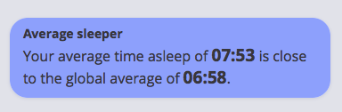

No June, because holidays, travel and offlineness. No July, for the same reasons, plus even before the month had ended I was deep into ...

... August, in which I did almost only one thing, and did it well, with great satisfaction.

===

Dogs Days of Podcasting is a challenge established a few years ago to record and publish a podcast every single day, from the first to the last of the month. I've done it a couple of times before, and enjoyed it, although I didn't make it part of Eat This Podcast. This year, I decided to do it again, telling my own, deeply personal and highly idiosyncratic story about wheat and bread, and to make it part of Eat This Podcast.

[And I made it](https://eatthispodcast.com/bread). Thirty-two podcasts (counting the trailer) without missing a single day.

What did I learn?

- That it is bloody hard work
- That I should have started to prepare much sooner, although, having said that, I also know how I am about deadlines
- That [The Archive](https://zettelkasten.de/the-archive/) and my own stumbling use of [Zettelkasten principles](https://zettelkasten.de) helped enormously
- That is was great fun for me, learning all kinds of new things
- That people said they enjoyed listening

There are surely other things, but those are the main ones. Would I do it again? Absolutely, and I would really do my very best to do more preparation. The days on which I had no buffer were stressful, and the stress got in the way of doing what I needed to do.

Now thinking about turning the scripts into prose and publishing some sort of book, which lots of listeners said they would like to see.

##Exist.io

 {.left} Steps and sleep both trended down over the month; not entirely surprising. Nice to see that I am still walking more and getting to bed earlier than the global average. Not too sure what to make of the news that sleeping almost an hour more than the global average is somehow "close to the global average". Not that I actually care to compare myself to everyone else.

##Work

Logged 185 hours for the month (an underestimate, for sure) and worked on 29 of the 31 days. And all for fun.

|	Month		|	Total		|	Daily		|	Admin %		|	ETP %		|Other %		|
|:-:		|:-:			|:-:			|:-:			|:-:			|:-:			|
|	08		| 185			| 8.0			|14			|85		| 1 |
|	07		| 68			| 5.25			|25			|63		| 12 |
|	06		| 96			| 5.75			|34			|9		| 57 |
|	05		| 151			| 6.0			|36			|20		| 44 |
|	04		| 159			| 7.5			|29			|29		| 40 |
|	03		|	152		|		7.0	|	20		|	10	| 70 |

###Tyme 

Might be time to delete this heading. Tyme is just great for my needs.

###Goals

No point berating myself for not achieving anything other than completing Dog Days of Podcasting.

##Itches

**Still** need to get back to putting that PHP course to use on getting micropub working with Grav. And pulling data out of exist.io?

Read later, bookmarking and annotation workflow also **still** need a lot of attention.

Fix that bloody table display; I've already wasted more than an hour of my precious OCD time on the damn thing.

##Final remarks

I think I will enjoy producing a book of Our Daily Bread, although I probably shouldn't call it that because it conflicts with a much more recondite book of the same name. And I have at least one interesting paid project lined up. So, back to more normal activities.
