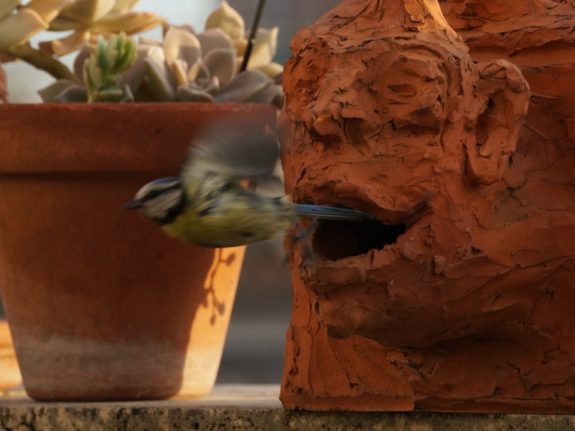

April was OK. We are much more fortunate than most, enjoying one another’s company, having a terrace, good ingredients nearby, jobs. We’ve got it all. Utterly selfishly, when the lockdown eases on Monday and the park opens, I'd prefer it to be open only to those of us who really want to know how nature took back ownership of the place, even if only temporarily. I know that’s not going to happen. Nor are the roads going to stay car-poor for long. But I can dream.

===

## Highlights of the month:

This!

[{.center}](tit-1-2020-04-30-1920.jpg)

[{.center}](tit-2-2020-04-30-1920.jpg)

- Launched the new theme for this here site; I hope nobody noticed.
- Got nabbed by the cops for talking a walk, to the tune of 280€.
- Watching the plants on the terrace wake up.
- The oven packed up in the middle of a big bake. That’s a lowlight. But a technician came early the next morning and fixed it. I love that about Italy.

### Exist.io

Weight down a teeny bit, sleep down a teeny bit. 

### Activities

April:
* Walking with sticks 0
* Reading: 12
* Steps (avge): 6260 (down even more)
* Podcasts: 31 (fewer steps => fewer podcasts)
* 7 Minutes: 21 days and 39 cycles (three cycles three times a week now)

March:  
* Walking with sticks: 5
* Reading: 18
* Steps (avge): 8553 (down quite a bit)
* Podcasts: 39 (but I know this is an underestimate)
* 7 minutes: 13 (almost daily now)

### Work

Finished the big new project to some acclaim, which was nice, and which threatens to bring more of the same. Now all those projects that were shuffled off to the back burner have to be brought back to the boil.

#### Hours logged per month
<noscript>
    
    

If you want to see the graphs, please enable javascript. Thanks.

    

</noscript>

<ul style="list-style-type: none; padding-left:2.4rem;">
<li>2020</li><li>2019</li><li>2018</li></ul>

#### Percent of logged hours: 2020
<noscript>
    
    

If you want to see the graphs, please enable javascript. Thanks.

    

</noscript>

<ul style="list-style-type: none; padding-left:2.4rem;">
<li>Admin</li><li>Eat This Podcast</li></ul>

 

Previous years are on [an archive page](https://jeremycherfas.net/blog/working-life).

### Goals

Eight new posts in April! And nine old ones, which is a big improvement. The oldies:

* [Are their lips moving?](https://www.jeremycherfas.net/blog/are-their-lips-moving/)
* [The Turk Will Rule](https://www.jeremycherfas.net/blog/the-turk-will-rule/) [^1]
* [Protect our sacred genome](https://www.jeremycherfas.net/blog/protect-our-sacred-genome/)
* [Food News 6](https://www.jeremycherfas.net/blog/food-news-6)
* [Jeepers’ cookies](https://www.jeremycherfas.net/blog/jeepers-cookies)
* [Food News 43](https://www.jeremycherfas.net/blog/food-news-43)
* [Eeeh by gum](https://www.jeremycherfas.net/blog/eeeh-by-gum)
* [Autonomy, mastery, purpose ... and bagels](https://www.jeremycherfas.net/blog/autonomy-mastery-purpose-and-bagels/)
* [What we need to be satisfied](https://www.jeremycherfas.net/blog/what-we-need-to-be-satisfied/)

[^1]: I should note that I did actually sign up to be a Mechanical Turk, and did a tiny amount of work, but I wasn’t temperamentally suited. And I’m blowed if I can find that account now.

### Niggles

I need to finish reviews, even mini-reviews, of the books I’ve read this year.

### Final remarks

It remains strange to have no clue where we will be or what we will be doing later in the summer, if we are not here, doing what we do.

----

## Here's the table

Click the triangle to see or hide the table

<table class="worktable">
<thead>
<tr>
<th style="text-align: right;" class="bigrow">Month</th>
<th style="text-align: center;" class="bigrow">Total</th>
<th style="text-align: center;" class="smallrow">Daily</th>
<th style="text-align: center;"class="smallrow">Admin %</th>
<th style="text-align: center;"class="smallrow">ETP %</th>
<th style="text-align: center;"class="smallrow">Other %</th>
</tr>
</thead>
<tbody>
<tr>
<td style="text-align: right;">04</td>
<td style="text-align: center;">175</td>
<td style="text-align: center;">6.03</td>
<td style="text-align: center;">36</td>
<td style="text-align: center;">18</td>
<td style="text-align: center;">46</td>
</tr>
<tr>
<td style="text-align: right;">03</td>
<td style="text-align: center;">164</td>
<td style="text-align: center;">7.50</td>
<td style="text-align: center;">38</td>
<td style="text-align: center;">27</td>
<td style="text-align: center;">35</td>
</tr>
<tr>
<td style="text-align: right;">02</td>
<td style="text-align: center;">129.0</td>
<td style="text-align: center;">6.50</td>
<td style="text-align: center;">45</td>
<td style="text-align: center;">17</td>
<td style="text-align: center;">38</td>
</tr>
<tr>
<td style="text-align: right;">2020-01</td>
<td style="text-align: center;">89.25</td>
<td style="text-align: center;">5.25</td>
<td style="text-align: center;">48</td>
<td style="text-align: center;">19</td>
<td style="text-align: center;">43</td>
</tr>
</tbody>
</table>

