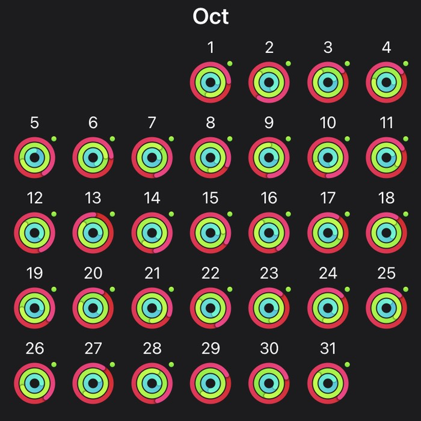

The good news is that my new passport arrived on Monday (first in November, but worth a mention). The bad is that we’re looking at another lockdown, albeit slightly lighter, and it seems highly unlikely that I’ll need a new passport before 2021 at the earliest. But we did manage a couple of days away in Florence, soaking up some culture to last through the dark days ahead. Marketing the podcast — at least as far as buying €30 of advertising on FB goes — was a complete bust. Not one new listener that I could detect. But more people do seem to be downloading the transcripts, so that’s surely a better use of the money.

===

## Highlights of the month:

- Two sets of data sent to two accountants.
- Terrific visit to the HQ of the Knights of Malta (not yet written up, alas).
- Minor tweakery to design and CSS on this site, mostly 99% invisible, I hope.
- Made 3½ jars of grape jam, and very good it is too.
- Started to alternate two cycles of intermediate moderate HIIT with customary three cycles of beginners ditto.
- Very difficult piece of work done to my satisfaction and, I think, the client’s.
- Lunch at the beach.

### Exist.io

Weight a little sown, steps up. Not sure how valuable this is any more.

### Activities

So, yeah, the new activity monitor is an Apple Watch SE. Not sure how that is going to affect presentation here.

{.center}

I really like it, although I mostly use it for telling the time. Such a loser. The fact of the SE does make glad I “wasted” some money on the previous less than useful MiBand. One of the strange things is that it will sometimes prompt you to add a workout, if you’re out walking purposefully. But the lack of a green dot on 29 and 30 October signifies only that we didn’t move fast enough to trigger that suggestion. Move we did, though, a total of 23.6 km plodding slowly through the Uffizi Galleries and most of the rest of Florence.

October: 
* Walking with sticks: 0
* Reading: 16 
* Steps (avge): 11,448
* Podcasts: 36 (But only 32 [logged](https://www.jeremycherfas.net/stream/); still no investigation)
* In bed/asleep 8:29/7:41
* 7 Minutes: 13 days and 34 cycles (started intermediate 2-cycle on 12 October)
* Weight (avge): 85.3 kg

September: 
* Walking with sticks: 0
* Reading: 14 
* Steps (avge): 8286 (but 10 days with barely a walk)
* Podcasts: 36 (But only 28 [logged](https://www.jeremycherfas.net/stream/); no investigation yet)
* In bed/asleep 8:31/7:46
* 7 Minutes: 9 days and 27 cycles (plus push-up-and-rotation now on the floor)

### Work

All going well. Still eating the frog, still getting things done. Slightly rocky start to a new project with some participants unclear as to my role and responsibilities (not my job to tell them initially). Moving forward more smoothly now.

#### Hours logged per month
<noscript>
    
    

If you want to see the graphs, please enable javascript. Thanks.

    

</noscript>

<ul style="list-style-type: none; padding-left:2.4rem;">
<li>2020</li><li>2019</li><li>2018</li></ul>

#### Percent of logged hours: 2020
<noscript>
    
    

If you want to see the graphs, please enable javascript. Thanks.

    

</noscript>

<ul style="list-style-type: none; padding-left:2.4rem;">
<li>Admin</li><li>Eat This Podcast</li></ul>

 

Previous years are on [an archive page](https://jeremycherfas.net/blog/working-life).

### Goals

Five new posts, again, no old ones brought in, again.

### Niggles

As we approach the end of the year, maybe I need to get serious about chartist.js, as I did, kinda sorta, about Tailwind.css this past month. Seems stupid to keep adding to the data in every monthly report, rather than keep it in one place and read it in when needed.

### Final remarks

Decided to get a Raspberry Pi in an effort to make myself a home server of some kind, after a near-death experience with the iMac and a deadline looming. SyncThing works a treat, but only when both machines are alive and well. So I need a machine that will stay alive and well and accessible no matter what happens to the other devices.

----

## Here's the table

Click the triangle to see or hide the table

<table class="worktable">
<thead>
<tr>
<th style="text-align: right;" class="bigrow">Month</th>
<th style="text-align: center;" class="bigrow">Total</th>
<th style="text-align: center;" class="smallrow">Daily</th>
<th style="text-align: center;"class="smallrow">Admin %</th>
<th style="text-align: center;"class="smallrow">ETP %</th>
<th style="text-align: center;"class="smallrow">Other %</th>
</tr>
</thead>
<tbody>
<tr>
<td style="text-align: right;">10</td>
<td style="text-align: center;">133.5</td>
<td style="text-align: center;">4.9</td>
<td style="text-align: center;">40</td>
<td style="text-align: center;">23</td>
<td style="text-align: center;">37</td>
</tr>
<tr>
<td style="text-align: right;">09</td>
<td style="text-align: center;">115.9</td>
<td style="text-align: center;">4.6</td>
<td style="text-align: center;">42</td>
<td style="text-align: center;">24</td>
<td style="text-align: center;">34</td>
</tr>
<tr>
<td style="text-align: right;">08</td>
<td style="text-align: center;">138.5</td>
<td style="text-align: center;">5.33</td>
<td style="text-align: center;">45</td>
<td style="text-align: center;">15</td>
<td style="text-align: center;">40</td>
</tr>
<tr>
<td style="text-align: right;">07</td>
<td style="text-align: center;">83.33</td>
<td style="text-align: center;">4.17</td>
<td style="text-align: center;">44</td>
<td style="text-align: center;">12</td>
<td style="text-align: center;">44</td>
</tr>
<tr>
<td style="text-align: right;">06</td>
<td style="text-align: center;">171</td>
<td style="text-align: center;">5.70</td>
<td style="text-align: center;">26</td>
<td style="text-align: center;">19</td>
<td style="text-align: center;">55</td>
</tr>
<tr>
<td style="text-align: right;">05</td>
<td style="text-align: center;">170</td>
<td style="text-align: center;">5.67</td>
<td style="text-align: center;">40</td>
<td style="text-align: center;">22</td>
<td style="text-align: center;">38</td>
</tr>
<tr>
<td style="text-align: right;">04</td>
<td style="text-align: center;">175</td>
<td style="text-align: center;">6.03</td>
<td style="text-align: center;">36</td>
<td style="text-align: center;">18</td>
<td style="text-align: center;">46</td>
</tr>
<tr>
<td style="text-align: right;">03</td>
<td style="text-align: center;">164</td>
<td style="text-align: center;">7.50</td>
<td style="text-align: center;">38</td>
<td style="text-align: center;">27</td>
<td style="text-align: center;">35</td>
</tr>
<tr>
<td style="text-align: right;">02</td>
<td style="text-align: center;">129.0</td>
<td style="text-align: center;">6.50</td>
<td style="text-align: center;">45</td>
<td style="text-align: center;">17</td>
<td style="text-align: center;">38</td>
</tr>
<tr>
<td style="text-align: right;">2020-01</td>
<td style="text-align: center;">89.25</td>
<td style="text-align: center;">5.25</td>
<td style="text-align: center;">48</td>
<td style="text-align: center;">19</td>
<td style="text-align: center;">43</td>
</tr>
</tbody>
</table>

