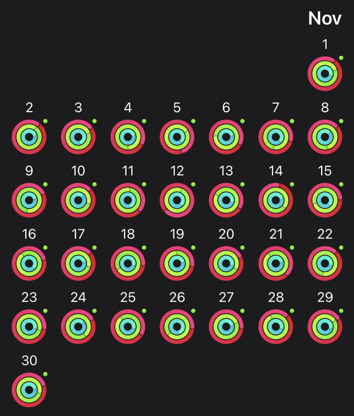

All clients have discovered unspent money and are rushing to dole it out before the end of the year, because if they don’t, they won’t have it next year. Which is crazy, and leads to some rough days, but is, on balance, good for me.  

Back in a lighter lockdown, and discovering that what this year has shown more than anything else is that we need one another more than we need outside things, but outside things do add to life.

===

## Highlights of the month:

- Inherited a first-generation iPad and it does the job, mostly.
- Very excited to play with a Raspberry Pi and have it act as a tiny private dropbox. Not tested outside the house yet.
- Some rough times with a new router, up and down like a dog at a fair. Finally got a second tech visit to rewire.
- Our first online wedding attended.
- More grape jam made.
- Majorly depressed for a day or two mid-month; lowlight.
- Taxes paid; death postponed.

### Exist.io

Not getting a lot out of exist any more.

### Activities

I’m sure this will get tiresome quickly, but for now I’m enjoying playing with the watch, and I actually appreciate the motivation it offers.

{.center}

#### November: 
* Walking with sticks: 0
* Reading: 14
* Steps (avge): 10,577 
* Podcasts: 44 (But only 29 [logged](https://www.jeremycherfas.net/stream/), and I think it is because if there is a newer episode, something goes wrong)
* In bed/asleep 8:40/7:52
* 7 Minutes: 11 days. Cycles irrelevant now; alternating 2 and 3.
* Weight (avge): 85.3 

#### October: 
* Walking with sticks: 0
* Reading: 16 
* Steps (avge): 11,448
* Podcasts: 36 (But only 32 [logged](https://www.jeremycherfas.net/stream/); still no investigation)
* In bed/asleep 8:29/7:41
* 7 Minutes: 13 days and 34 cycles (started intermediate 2-cycle on 12 October)
* Weight (avge): 85.3 kg. 

### Work

Having a name for Eating the Frog and doing it has made a huge difference. There is still, though, and after all these years, FONBAA: fear of never being asked again. I learned long ago that doubling the price on a job, only to have the client accept anyway, actually doubles the misery of a job I don’t want to do in the first place. I need to Just Say No.

I’m quite surprised that the percentages for two big categories are identical this month to last, despite a large difference in total. I suppose that’s bound to happen, sometimes.

#### Hours logged per month

<noscript>
    
    

If you want to see the graphs, please enable javascript. Thanks.

    

</noscript>

#### Percent of logged hours: 2020
<noscript>
    
    

If you want to see the graphs, please enable javascript. Thanks.

    

</noscript>

 

Previous years are on [an archive page](https://jeremycherfas.net/blog/working-life).

### Goals

Only two new posts, and still no old ones brought in.

### Niggles

Made a start on getting sensible about graphical presentation of data, but it is so hard to learn just enough to do some thing, while also actually understanding what I am doing. I do not want to become a javascript programmer. I just want to make javascript do something.

### Final remarks

It’s been a rough month, in a rough year. But there is 46 to look forward to, with some trepidation.

----

## Here's the table

Click the triangle to see or hide the table

<table class="worktable">
<thead>
<tr>
<th style="text-align: right;" class="bigrow">Month</th>
<th style="text-align: center;" class="bigrow">Total</th>
<th style="text-align: center;" class="smallrow">Daily</th>
<th style="text-align: center;"class="smallrow">Admin %</th>
<th style="text-align: center;"class="smallrow">ETP %</th>
<th style="text-align: center;"class="smallrow">Other %</th>
</tr>
</thead>
<tbody>
<tr>
<td style="text-align: right;">11</td>
<td style="text-align: center;">149.5</td>
<td style="text-align: center;">5.75</td>
<td style="text-align: center;">40</td>
<td style="text-align: center;">23</td>
<td style="text-align: center;">37</td>
</tr>
<tr>
<td style="text-align: right;">10</td>
<td style="text-align: center;">133.5</td>
<td style="text-align: center;">4.9</td>
<td style="text-align: center;">40</td>
<td style="text-align: center;">23</td>
<td style="text-align: center;">37</td>
</tr>
<tr>
<td style="text-align: right;">09</td>
<td style="text-align: center;">115.9</td>
<td style="text-align: center;">4.6</td>
<td style="text-align: center;">42</td>
<td style="text-align: center;">24</td>
<td style="text-align: center;">34</td>
</tr>
<tr>
<td style="text-align: right;">08</td>
<td style="text-align: center;">138.5</td>
<td style="text-align: center;">5.33</td>
<td style="text-align: center;">45</td>
<td style="text-align: center;">15</td>
<td style="text-align: center;">40</td>
</tr>
<tr>
<td style="text-align: right;">07</td>
<td style="text-align: center;">83.33</td>
<td style="text-align: center;">4.17</td>
<td style="text-align: center;">44</td>
<td style="text-align: center;">12</td>
<td style="text-align: center;">44</td>
</tr>
<tr>
<td style="text-align: right;">06</td>
<td style="text-align: center;">171</td>
<td style="text-align: center;">5.70</td>
<td style="text-align: center;">26</td>
<td style="text-align: center;">19</td>
<td style="text-align: center;">55</td>
</tr>
<tr>
<td style="text-align: right;">05</td>
<td style="text-align: center;">170</td>
<td style="text-align: center;">5.67</td>
<td style="text-align: center;">40</td>
<td style="text-align: center;">22</td>
<td style="text-align: center;">38</td>
</tr>
<tr>
<td style="text-align: right;">04</td>
<td style="text-align: center;">175</td>
<td style="text-align: center;">6.03</td>
<td style="text-align: center;">36</td>
<td style="text-align: center;">18</td>
<td style="text-align: center;">46</td>
</tr>
<tr>
<td style="text-align: right;">03</td>
<td style="text-align: center;">164</td>
<td style="text-align: center;">7.50</td>
<td style="text-align: center;">38</td>
<td style="text-align: center;">27</td>
<td style="text-align: center;">35</td>
</tr>
<tr>
<td style="text-align: right;">02</td>
<td style="text-align: center;">129.0</td>
<td style="text-align: center;">6.50</td>
<td style="text-align: center;">45</td>
<td style="text-align: center;">17</td>
<td style="text-align: center;">38</td>
</tr>
<tr>
<td style="text-align: right;">2020-01</td>
<td style="text-align: center;">89.25</td>
<td style="text-align: center;">5.25</td>
<td style="text-align: center;">48</td>
<td style="text-align: center;">19</td>
<td style="text-align: center;">43</td>
</tr>
</tbody>
</table>

